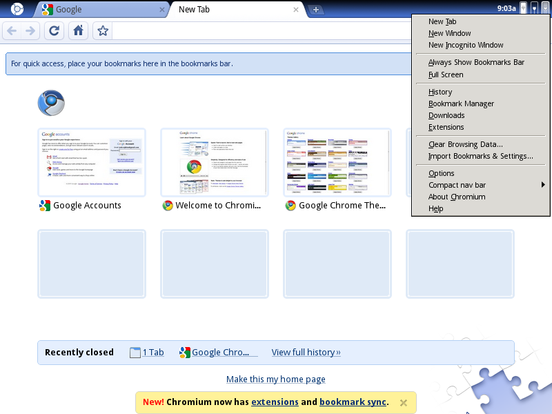

> **Archiwum (bardzo) młodego programisty.** Ten wpis pochodzi z mojego bloga, którego prowadziłem będąc uczniem Gimnazjum (obecnie są to klasy 6-8 szkoły podstawowej). Z sentymentu i rozczulenia postanowiłem przenieść te treści na moją nową stronę internetową. Na samym dole załączone są komentarze (jeśli jakieś były). [Tutaj przeczytasz o tym jak wyglądała moja pierwsza strona i przygoda z programowaniem]()
> 

Tak. Stało się to, na co czekało wielu użytkowników linuksa – Google wydało wersję przeglądarki Chrome przeznaczoną na linuksa. Narazie przeglądarka posiada wersję tylko na kilka dystrybucji – na Debiana, Ubunty, Fedorę i OpenSUSE. Wcześniej był już dostępny rozwijany przez społeczność odpowiednik Chroma – przeglądarka Chromium. Jednak wydajnością i estetyką daleko jej było do przeglądarki Google.

