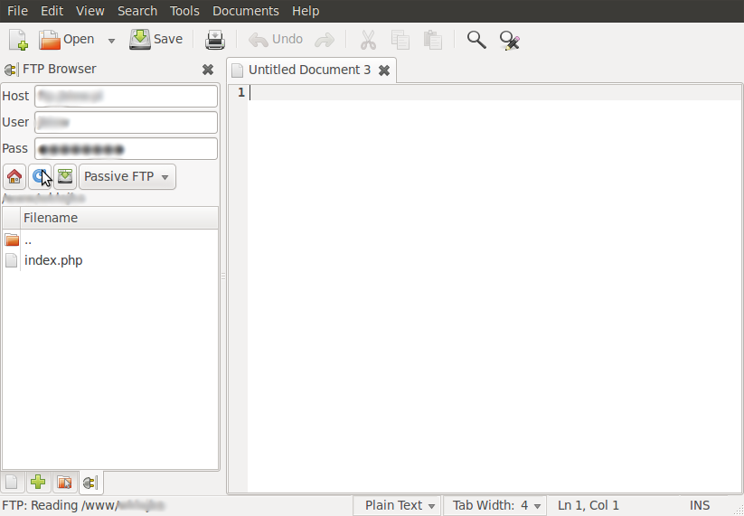

> **Archiwum (bardzo) młodego programisty.** Ten wpis pochodzi z mojego bloga, którego prowadziłem będąc uczniem Gimnazjum (obecnie są to klasy 6-8 szkoły podstawowej). Z sentymentu i rozczulenia postanowiłem przenieść te treści na moją nową stronę internetową. Na samym dole załączone są komentarze (jeśli jakieś były). [Tutaj przeczytasz o tym jak wyglądała moja pierwsza strona i przygoda z programowaniem]()
> 

Czy ktoś z was nie zastanawiał się, jak można rozbudować prostego gedita?

Też mnie to trapiło, i wiele szukałem. Także sporo znalazłem. Pierwszym dodatkiem, który znalazłem był Gedit Ftp Browser. Jest to prosty przydatny dodatek do edycji plików ftp online. Można go pobrać z tej strony: [http://code.google.com/p/gedit-ftp-browser/](http://code.google.com/p/gedit-ftp-browser/). 

Aby go zainstalować należy utworzyć nowy folder w `/home/user/.gnome2/gedit/plugins`, i wrzucić tam pliki pobrane z powyższej strony.

