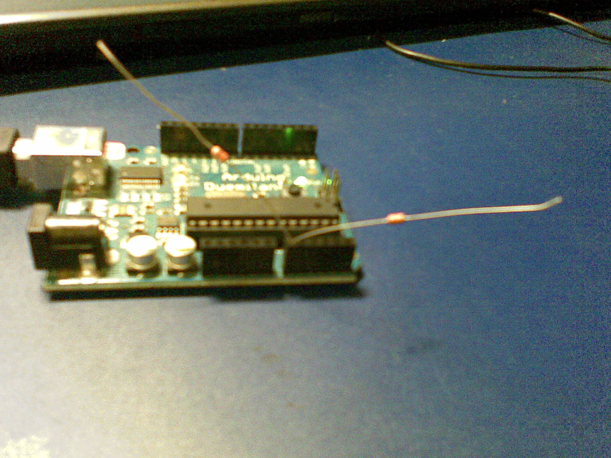
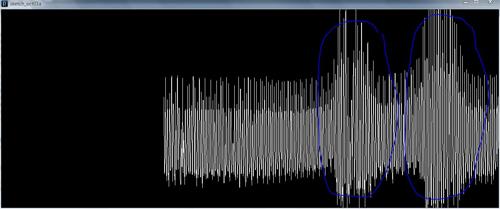

> **Archiwum (bardzo) młodego programisty.** Ten wpis pochodzi z mojego bloga, którego prowadziłem będąc uczniem Gimnazjum (obecnie są to klasy 6-8 szkoły podstawowej). Z sentymentu i rozczulenia postanowiłem przenieść te treści na moją nową stronę internetową. Na samym dole załączone są komentarze (jeśli jakieś były). [Tutaj przeczytasz o tym jak wyglądała moja pierwsza strona i przygoda z programowaniem]()
> 

Zastanawiałeś się kiedyś jak działają bezdotykowe czujniki, które reagują na przyłożenie ręki? Chciałbyś taki czujnik zbudować? Jest to niezwykle proste, a potrzebne części kosztują grosze! Nie musisz kupować kosztownych przełączników pojemnościowych. Zrób to sam!

## Sposób I – mikrokontroler i rezystor

Tak. Jak już czytaliście na blogu od pewnego czasu interesuję się elektroniką, więc stwierdziłem, że warto coś w tej materii napisać.

Dość niedawno przez przypadek byłem świadkiem debaty jak zrobić estetyczny włącznik światła w biblioteczce. Wtrąciłem się do rozmowy i zauważyłem, że można zrobić czujnik bezstykowy i ukryć go we wnętrzu szafki. Pomysł od razu zyskał aprobatę i zostałem poproszony o wykonanie takiego gadżetu. Masz babo placek! Nigdy wcześniej nie budowałem podobnego urządzenia.

Po powrocie do domu bez zwłoki zacząłem eksperymentować i otrzymałem nader interesujące wyniki. Przedstawię je tutaj, a wszystkich zachęcam do robienia w domu tych samych eksperymentów.

W sieci natrafić można na na pomysł zastosowania arduino jako pseudooscyloskopu. Wykorzystamy do naszych celów ten pomysł. Kod dla arduino oraz tutorial znajdują się [na tej stronie](http://starter-kit.nettigo.pl/2009/11/processing-interfejs-na-sterydach/). Aby lepiej obejrzeć przebieg zakłóceń proponujępobrać modyfikację kodu dla processinga, który jest na dole strony. Kod ze strony należy podmienić na ten pobrany. (Nawiasem mówiąc można go jeszcze zoptymalizować, a najlepiej napisać w innym języku programowania, ale ten nam w zupełności wystarczy.)  Następnie podłączcie dwa rezystory (małej wartości, a mogą być nawet kawałki drucika) do pinu analog_0 arduino, tak jak na obrazku poniżej:



Następnie wgrajcie kod do arduino i uruchomcie program w processingu. Powinniście zobaczyć następujące okno:



Na niebiesko zaznaczyłem miejsca gdzie przyłożyłem rękę do rezystorów (bez dotykania oczywiście!). Jak widzicie zmienia się amplituda zakłóceń. Ale zmienia się także wypełnienie, czego tak dobrze nie widać na obrazku. My wykorzystamy fakt zmiany wypełnienia. Zapraszam do skopiowania kodu arduino (pod kodem dla processing), który będzie zapalał diodę pod pinem 13, gdy zbliżymy rękę.

Mały program, a cieszy! Jak widzicie w prosty sposób można zrobić ciekawy gadżet. Oczywiście nie ma potrzeby stosowania tu arduino. Równie dobrze można zastosować jakikolwiek mikrokontroler z przetwornikiem analogowo/cyfrowym.

Wadą tego rozwiązania jest mała stabilność, duża podatność na zakłócenia, oraz trudna regulacja zasięgu. Na niektóre osoby układ będzie reagował z większej odległości, podczas gdy na inne nie. **Jednak wadom tym można zapobiiec w prosty sposób! W następnym odcinku opiszę, jak to zrobić.**


## Kod pseudooscyloskopu w processing.js

```js
import processing.serial.*;

Serial port;  // Create object from Serial class
int val;      // Data received from the serial port
int i;
int lastval;
void setup()
{
  size(1200, 480);
  // Open the port that the board is connected to and use the same speed (9600 bps)
  port = new Serial(this, Serial.list()[1], 9600);
  i=0;
  lastval = 0;
  background(0);
  stroke(255);
}

int getY(int val) {
  return (int)(val / 1023.0f * height) - 1;
}

void draw()
{
  while (port.available() >= 3) {
    if (port.read() == 0xff) {
      val = (port.read() << 8) | (port.read());
    }
  }
  i++;
  if (i>=width-1) {
    i=0;
    background(0);
    stroke(255);
  }
    line(width-i,   height-1-getY(lastval),
         width-1-i, height-1-getY(val));
    lastval = val;
}
```


## Kod arduino dla czujnika

```c
#define ANALOG_IN 0
long numup = 0;
long starttime = 0;
long micstim = 0;
int lastval = 0;
int state = LOW;
void setup() {
  Serial.begin(9600);
  pinMode(13, OUTPUT);
}

void loop() {
  numup = 0;
  starttime = millis();
  while(millis() < starttime+200) {
    int val = analogRead(0);
    if(lastval <= 512 && val > 512) {
      micstim = micros();
    }
    if(lastval > 512 && val <= 512) {
      numup += micros() - micstim;
    }
    lastval = val;
    delayMicroseconds(5);
  }
  float percent = float(numup)/float((millis()-starttime)*1000)*float(100);
  Serial.println(percent);
  if(percent > 13) digitalWrite(13, HIGH); // UWAGA! nalezy eksperymentalnie dobrac‡ta wartosc‡
  else digitalWrite(13, LOW);
}
```