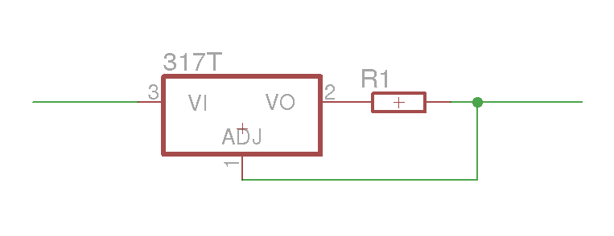

> **Archiwum (bardzo) młodego programisty.** Ten wpis pochodzi z mojego bloga, którego prowadziłem będąc uczniem Gimnazjum (obecnie są to klasy 6-8 szkoły podstawowej). Z sentymentu i rozczulenia postanowiłem przenieść te treści na moją nową stronę internetową. Na samym dole załączone są komentarze (jeśli jakieś były). [Tutaj przeczytasz o tym jak wyglądała moja pierwsza strona i przygoda z programowaniem]()
> 

Przeglądając datasheet regulatora **lm317** natknąłem się na ciekawy schemat układu, który **ogranicza natężenie** przepływającego prądu. Schemat wygląda następująco:

Limit natężenia jest równy:

> Ilimit = 1,2/R1

Układ co  prawda według instrukcji ma służyć ograniczaniu natężenia, ale w praktyce można go wykorzystać jako zabezpieczenie przeciwzwarciowe lub **aktywne obciążenie**.

Dodam, że układ jest bardzo precycyjny **i temperatura nie ma wpływu** na jego pracę. Po więcej informacji zapraszam do niektórych datasheet-ów lm317.

PS. Co do obiecanej drugiej części wpisu na temat czujników pojemnościowych, to niestety musicie jeszcze trochę poczekać: zamówione części jeszcze do mnie nie dotarły.