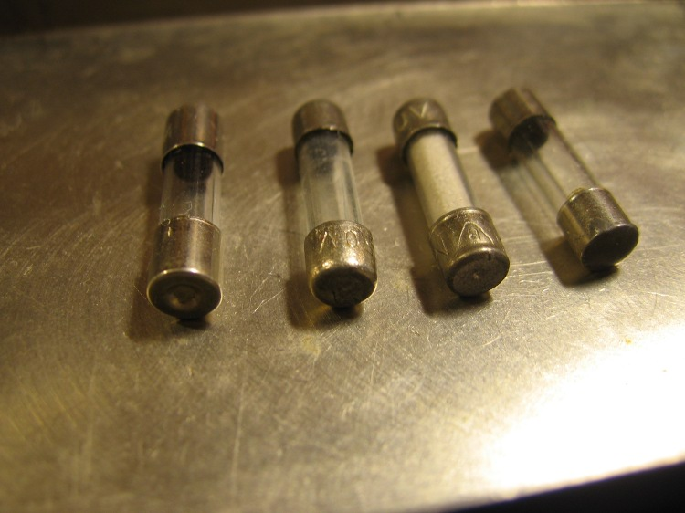
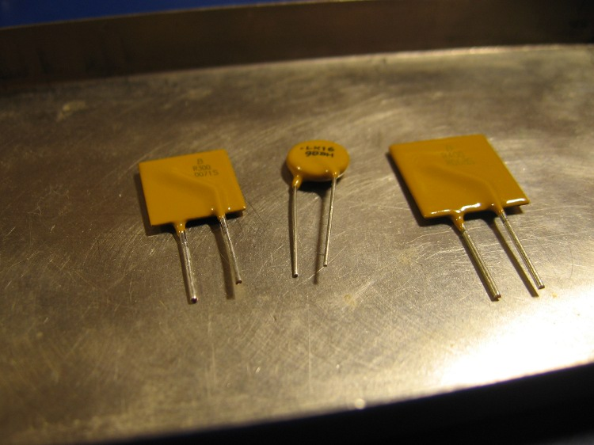
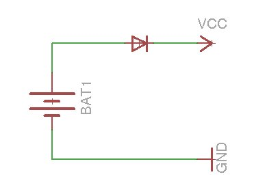
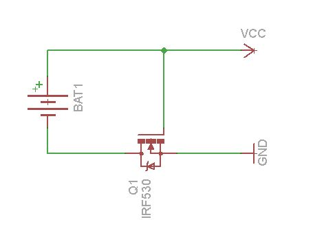
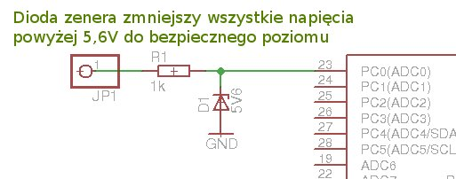

> **Archiwum (bardzo) młodego programisty.** Ten wpis pochodzi z mojego bloga, którego prowadziłem będąc uczniem Gimnazjum (obecnie są to klasy 6-8 szkoły podstawowej). Z sentymentu i rozczulenia postanowiłem przenieść te treści na moją nową stronę internetową. Na samym dole załączone są komentarze (jeśli jakieś były). [Tutaj przeczytasz o tym jak wyglądała moja pierwsza strona i przygoda z programowaniem]()
> 

Fajnie jest konstruować różne urządzenia, przeprowadzać eksperymenty… Musimy jednak pamiętać o bezpieczeństwie. O bezpieczeństwie konstruktora, użytkowników, a także samego układu elektronicznego. Co to byłoby za urządzenie, które psułoby się od najzwyklejszej pomyłki, jaką jest odwrotne podłączenie baterii. Postaram się po krótce pokazać kilka sposobów na zapewnienie prawdłowej pracy i bezpieczeństwa naszym układom.

## Zwarcia

Nierzadko w układach elektronicznych może dojść do zwarcia, np. z powodu dotknięcie się przewodów, czy przebicia w jakimś elemencie. Jeśli mamy zasilacz z ograniczeniem natężenia nie stanowi to dla nas problemu. Jednak gdy zasilamy układ z sieci 230V przez transformator, zwarcie może doprowadzić do jego uszkodzenia, a nawet do pożaru. Jeszcze gorzej jest np. w przypadku używania ogniw li-pol. W wypadku zwarcia może nawet dojść do wybuchu, nie mówiąc już o pożarze.

Najpopularniejszym sposobem jest dodanie do układu bezpiecznika. Najczęściej używany jest bezpiecznik topikowy (zdjęcie poniżej).

Wielkim minusem takiego bezpiecznika jest to, że po przepaleniu trzeba wymienić go na nowy.

Na szczęście technika idzie cały czas do przodu i w końcu ludzie wymyślili bezpieczniki wielokrotnego użytku, tzw. bezpieczniki polimerowe. Można je zobaczyć na poniższym zdjęciu.

Podobnie jak zwykły bezpiecznik, podczas zwarcia bezpiecznik polimerowe przerywa obwód i prąd przestaje płynąć. Natomiast gdy usuniemy usterkę, bezpiecznik po kilku minutach z powrotem zacznie przewodzić! Nie musimy się stresować i wymieniać go na nowy! Plusem jest też cena. Taki bezpiecznik kosztuje ok. 0,5zł – 5zł.

Ewentualnie, jeśli układ pobiera niewielki prąd możemy dodać ogranicznik natężenia ([przykład takiego ogranicznika na lm317]()), a nawet dodać rezystor o niewielkiej oporności i mocy kilku wat.

## Odwrotne podłączenie baterii

Często zdarza się, że ktoś przez nieuwagę odwrotnie włoży baterię. Większość cyfrowych układów, a w szczególności mikrokontrolery, źle znoszą ujemne napięcia zasilania. Najczęściej kończy się to uszkodzeniem układu.

Najprotszy obwód zabezpieczający, to dioda podłączona szeregowo w linii zasilania, jak na rysunku:

Niestety na diodzie występuje spadek napięcia, i to wcale nie mały, bo od 0,5V, do 1V. Nie jest to problemem, jeśli zasilamy układ dużym napięciem. Jeśli jednak nasze urządzenie jest zasilane niskim napięciem (np. z baterii), cenny jest każdy wolt. Spadek możemy zmniejszyć stosując diodę Schottkiego, która „pożera” od 0,3V do 0,5V.

Jest jednak sposób,  aby radykalnie zmniejszyć spadek napięcia i zabezpieczyć układ przed odwrotną polaryzacją zasilania! Wystarczy zbudować układ z poniższego obrazka z tranzystorem n-mosfet (lub odwrotny z p-mosfet). Spadek napięcia w tym układzie wyniesie mniej niż 0,1V! Należy pamiętać, aby użyć tranzystora z wbudowaną diodą.

## Zbyt wysokie napięcia na wejściu mikrokontrolera

Czasem zdarza się, że chcemy podłączyć do mikrokontrolera linię, na której napięcia mogą przekroczyć bezpieczne 5V. W takim wypadku należy zastosowaćukład z poniższego rysunku:

W powyższym układzie dioda zenera wywoła spadek napięcia na rezystorze i zmniejszy napięcia powyżej 5,6V do bezpiecznego poziomu. Dzięki temu napięcia wyższe niż 5V nie uszkodzą mikrokontrolera. Pamiętajmy też, że układ nie zabezpiecza przed „szpilkami” z cewek, silników, etc, gdyż dioda zenera jest zbyt wolna. Bezwzględnie należy stosować zabezpieczenie diodowe w układach z elementami indukcyjnymi.

## Komentarze (archiwum ze starej strony)

> Ciekawy artykuł, z resztą nie tylko ten. Ogólnie cała strona jest niezła.
> 
> — Pawlu10 on Grudzień 31st, 2010 at 22:41

> nalezy sprawdzic:)
> 
> — Reahaccoviero on Luty 1st, 2011 at 7:47