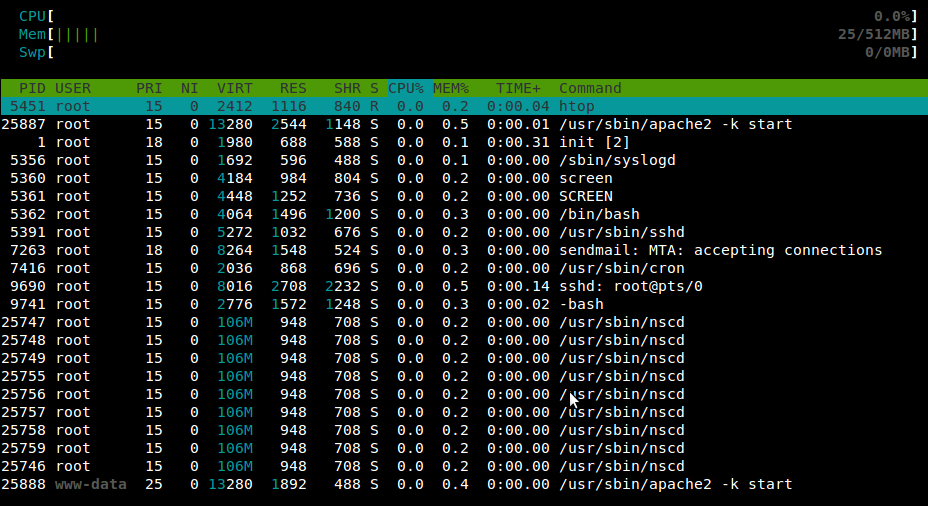

> **Archiwum (bardzo) młodego programisty.** Ten wpis pochodzi z mojego bloga, którego prowadziłem będąc uczniem Gimnazjum (obecnie są to klasy 6-8 szkoły podstawowej). Z sentymentu i rozczulenia postanowiłem przenieść te treści na moją nową stronę internetową. Na samym dole załączone są komentarze (jeśli jakieś były). [Tutaj przeczytasz o tym jak wyglądała moja pierwsza strona i przygoda z programowaniem]()
> 

Na ubuntu było >100mb…

## Komentarze (archiwum ze starej strony)

> Nie no, trochę przesadziłem z tymi 100mb. Jeszcze raz musiałem zainstalować ubuntu i okazało się, że „na czysto” zabiera 60mb ramu.
> 
> — JBLew on Marzec 19th, 2011 at 12:12
