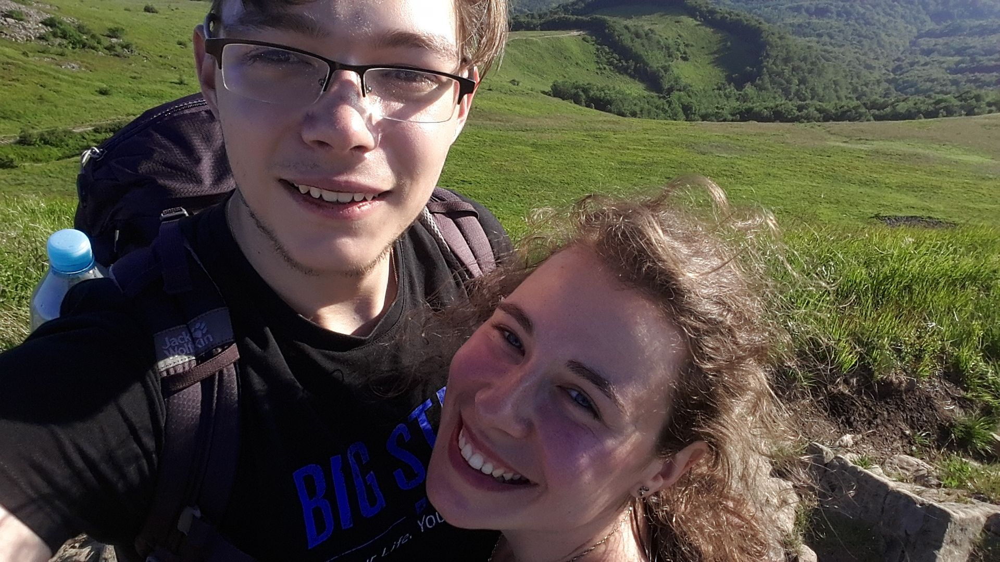
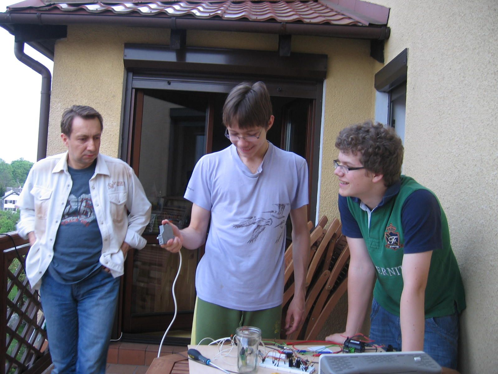
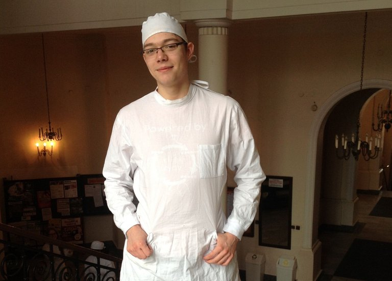
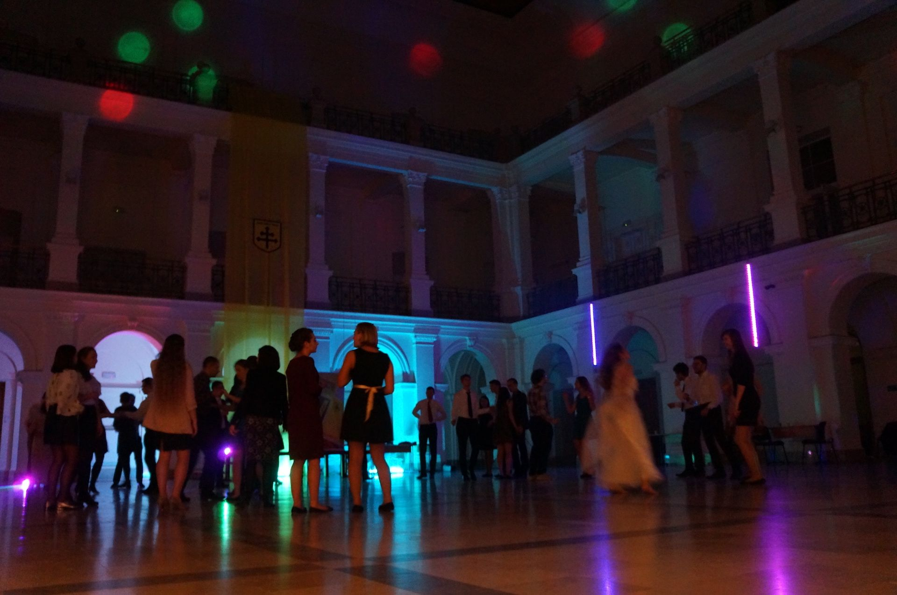
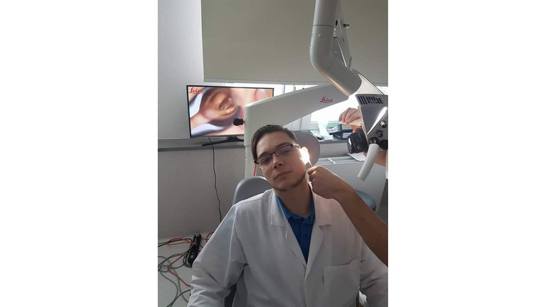

> W latach 2018-2019 pracowałem w startupie blockchainowym jako Architekt aplikacji wspomagającej delegowanie voting power na platformie Steem.
> 
> Od tego czasu wiele się zmieniło:
> 1. Ze względu na spadek ceny tej kryptowaluty zrezygnowaliśmy z prowadzenia startupu Wise
> 2. Doszło do próby przejęcia Steema przez firmę, która zakupiła Steemit (twórców blockchainu Steem)
> 3. Dzięki szybkiej i zorganiowanej akcji Witnessów Steem został przeniesiony na Hive
> 
> Ze względu na niestabilną sytuację i niepewną przyszłość Steem oraz Hive — zdecydowałem sie na przeniesienie treści z blockchainu na własną stronę internetową.

> Oryginalny post tu: https://hive.blog/introduceyourself/@jblew/witajcie-steemianie-przybywam-jedrzej-lewandowski

> TLDR (vel abstract): programista Javy i webdeveloper od dzieciństwa. Student 4 roku na II Wydziale Medycznym Warszawskiego UM. Chciałbym pracować jednocześnie jako lekarz i jako programista (kibicujcie :) ). Na Steemie zamierzam pisać o służbie zdrowia i udzielać się w tematach IT.

Na zdjęciu moja piękna Karolina i ja, a w tle polskie Bieszczady (najwspanialsze góry świata).

Witajcie Steemianie! Bardzo się cieszę, że dolączyłem do tak zacnej społeczności. O Steemie powiedział mi w 2016 Patryk [@perduta](https://hive.blog/@perduta). Bardzo zainteresowała mnie wówczas idea Steema, ale w tamtym roku byłem głównie pochłonięty studiami medycznymi. Natomiast w tym roku wróciłem do świata programistów i [@noisy](https://hive.blog/@noisy) namówił mnie, żeby się przedstawić!

## Kim jestem?

Rzymskim katolikiem, ale oprócz tego od dzieciństwa programistą Javy, a od czterech lat studiuję na II Wydziale Lekarskim i za trzy lata mam nadzieję pomóc swojemu pierwszemu pacjentowi :)

Jak do tego doszło, że komputerowy szaleniec postanowił porzucić klawiaturę i szlifować szpitalne podłogi? Zapraszam do lektury!

Kiedy byłem małym chłopcem (hej) — wyobrażałem sobie, że jestem prezesem wielkiej firmy, tworzącej maszyny ułatwiające ludziom życie i wprawiające innych w zachwyt (w zasadzie chciałem być obecnym Elonem Muskiem). Jednym słowem — chciałem być Wielkim.

Naukę zacząłem w szkole wiejskiej. Jest to istotny szczegół — szkoła nie miała strony internetowej i właśnie dzięki temu zająłem się programowaniem. Mój wspaniały ojciec postanowił, że to okazja, żeby nauczyć czegoś ciekawego swojego dziewięcioletniego syna. Tak stworzyliśmy moją pierwszą stronę internetową (ściślej mówiąc naukę Javy zacząłem nieco wcześniej, gdy grypa unieruchomiła mojego Tatę w domu i miał czas, żeby zainteresować mnie programowaniem).

Do prawdziwego programowania najbardziej zachęcił mnie jednak przyjaciel — Patryk. Rok 2010 rok był wśród polskiej geekowej młodzieży okresem dużej popularności chatów IRC i gier typu MUD. Jest to najstarszy typ sieciowych gier multiplayer. W skrócie: MUD to gra o tekstowym interfejsie — logujesz się za pomocą protokołu telnet. Chcesz kogoś zaatakować? wpisujesz "kill zly_ork", chcesz coś zjeść? "eat zelaznaracja".

Jedna z wielu wersji naszej gry — tutaj z własnym kilentem para-graficznym (mapa z literek w rogu!).

Patryk postanowił, że my też napiszemy taką grę. Wciągnął mnie tak bardzo, że przez 3 lata powstawały różne wersje gry i dodawane były różne funkcje. Na początku zacząłem pisać w PHP, ale szybko okazało się, że potrzebowaliśmy wielowątkowości — i tak wszedłem w świat Javy. W międzyczasie przewinęło się także kilka innych aplikacji pisanych z ciekawości oraz kilka stron internetowych.

Jednocześnie w tamtym czasie bardzo zainteresowały mnie także fizyka, elektronika, a najbardziej — styk świata cyfrowego i analogowego.

Powyżej z Patrykiem budujemy generator wysokiego napięcia ze starego trafopowielacza.

Poświęcając większość swojego wolnego czasu na programowanie, dotarłem do liceum i tu pojawił się dylemat odnośnie dalszej przyszłości. Iść do pracy, czy studiować? Jeżeli studiować — to co? Wydawało mi się, że nie warto studiować na kierunku informatycznym (chciałem być programistą, posiadałem już spore umiejętności — jednak zamiast akademickiej wiedzy potrzebowałem doświadczenia). Miałem niebosiężne plany — marzyłem o wielkiej karierze, o świetnie prosperującym startupie, o byciu milionerem. Chciałem być podziwiany. Byłem wtedy młody i głupi!

W międzyczasie nieoczekiwanie przydarzyła mi się wycieczka do laboratorium, gdzie wykonywano eksperymenty mykologiczne (badania nad grzybami). Skomplikowany sprzęt, rygorystyczne procedury i przede wszystkim możliwość zmierzenia "niemierzalnej biologii" — kupiły mnie. Wtedy pierwszy raz pomyślałem — a może tak pójść na studia medyczne? Będę robił eksperymenty, zapiszę się do kół naukowych — zostanę wielkim badaczem i odkrywcą! Na początku nawet planowałem nie podejmować praktyki lekarskiej po studiach. Wyobrażałem sobie siebie w białym kitlu przed gloveboxem albo zbierającego owacje na konferencji naukowej.

Wizja była kusząca, więc poświęciłem prawie 100% swojego czasu na przygotowania do egzaminu maturalnego. Oddałem się nauce z takim zapamiętaniem, że przestałem zupełnie myśleć o tym, jak będą wyglądały studia i praca po studiach. Liczyła się tylko nauka chemii, biologii i fizyki do matury na poziomie rozszerzonym. Chciałem sobie "zaklepać" naukową karierę wysokim wynikiem. (Oprócz nauki chemii i biologii, przed studiami nie przeczytałem niczego o tematyce medycznej. Potem, na pierwszym roku studiów, koledzy śmiali się ze mnie, że nie wiem, co to jest stetoskop :-D).

Przyszedł maj, zakwitły kasztany. Nauka się opłaciła — dostałem się na studia! I wtedy nagle poczułem pustkę. Dotarło do mnie — trafiłem na studia medyczne. Służba zdrowia — służba? Będę służącym? Pacjenci — będzie trzeba z nimi rozmawiać, będą mieli swoje choroby, historie życia. Mnóstwo interakcji między ludźmi (to nie wydawały się przyjazne wody). Uporczywie i kurczowo trzymałem się myśli — będę tylko naukowcem.

Pozostawała jeszcze kwestia programowania. W któryś z ostatnich dni września napisałem ostatnią linię kodu. Zrobiłem ostatni commit. Z rozrzewnieniem żegnałem się z terminalem. Odinstalowałem NetBeansa (edytor kodu gł. Javy). Poczułem się wolny. Byłem podekscytowany zmianą otoczenia. To było uczucie, jakbym wstępował do jakiegoś tajemniczego zakonu. Kości zostały rzucone — zamieniam karierę programisty na karierę naukowca.

W fartuchu prosektoryjnym — przed zajęciami z anatomii.

Studia medyczne są fascynujące. Szczególnie na początku. Są bardzo wymagające, a jednocześnie wiedza jest tajemnicza. Pierwszy rok polega głównie na nauczeniu się ponad 10 tysięcy różnych nazw po łacinie i angielsku z zakresu anatomii i histologii (jak anatomia, ale pod mikroskopem). Pouczające są zajęcia z anatomii na ciałach osób, które zgodziły się poświęcić swoje doczesne szczątki w celach edukacyjnych. W ten sposób przekazuje się nam szacunek do życia.

Kolejne lata nie są już tak tajemnicze i niezwykłe. Wiedzę zgłębia się w bardziej współczesnych językach. Studenci powoli odkrywają, że medycyna to nie "Dr House" ani "Chirurdzy". To przede wszystkim niekończące się powiązania objawów i chorób. Leków i przeciwwskazań. Różnicowanie objawów, np. setki przyczyn powiększenia węzłów chłonnych. Przez te kilka lat odkryłem, że nie istnieje coś takiego jak klasyczny przypadek. Każdy chory jest inny, wszyscy są nietypowi. To piękne i straszne. Właśnie to czyni medycynę sztuką.

Studia skonfrontowały mnie z moją "zaplanowaną karierą". Jest powiedzenie: "Dla każdego matematyka można zdefinować takie środowisko, w którym jest on wybitny". W szkole zawsze byłem zdolnym uczniem, nauka kosztowała mnie niewiele czasu — mogłem poświęcić go na kodowanie. Myślałem, że tak będzie zawsze. Jednak studia utarły mi nosa. Okazało się, że jest wiele osób zdolniejszych ode mnie — że tu nauka wcale nie jest taka łatwa.

Powoli odkrywałem, że od dawna kieruje mną pycha. Uważałem się za wybitnego człowieka. W moim własnym mniemaniu kariera naukowa była jedyną karierą godną tak zdolnej jednostki, jak ja. Na studiach zauważyłem, że wcale nie jestem tak inteligentny, za jakiego się mam. Najważniejszym odkryciem było jednak to, że w moim przypadku najlepsza droga do szczęścia to służba bliźniemu. Odkryłem, że aby być zadowolonym wcale nie muszę być znany i ceniony — będę szczęśliwszy, będąc komuś potrzebnym. To jest wspaniała wiedza i najlepsze, czego się dowiedziałem o sobie. Dostrzegłem, że jestem rozradowany poczuciem dobrej służby.

Jestem wdzięczny Bogu, że tak pokierował moim życiem. Gdybym nie trafił na medycynę — mógłbym stać się jeszcze bardziej zarozumiały. Zadzierałbym nosa jako naukowiec, albo frustrowałbym się, że nie jestem najwybitniejszym z programistów. Dalej szukałbym chwały i próbował piąć się na piedestał. Z drugiej strony: gdybym nie programował — nie trafiłbym na medycynę. Na szczęście w kwestii programowania jeszcze nie padło ostatnie słowo.

Na drugim roku studiów zapisałem się do Akademickiego Stowarzyszenia Katolickiego Soli Deo. Szybko trafiłem do komórki zajmującej się organizowaniem katolickich dyskotek (ok. 5-6 w roku, po 100-160 osób). Naszym problemem była niewielka ilość sprzętu. Ponieważ od zawsze jestem człowiekiem lubiącym DIY (do-it-yourself) i znałem się już trochę na elektronice, pomyślałem: "Stworzę własny system oświetlenia". Wymagało to ode mnie powrotu do programowania. Podszedłem do tego ostrożnie: "Napiszę tyle, ile trzeba i zakończę to. Chcę być naukowcem, nie programistą — lepiej się nie angażować w ten związek.

Dyskoteka Soli Deo z okazji inauguracji roku akademickiego na Wydziale Fizyki Uniwersytetu Warszawskiego (na filarach oraz pod sceną widoczne elementy wykonanego oświetlenia).

Konstruując oświetlenie spędziłem prawie sto godzin nad programem pisanym w Javie, kilkadziesiąt następnych na lutowaniu kilku prototypów. Spostrzegłem, że programowanie mnie relaksuje. Po pewnym czasie już nawet nie czułem się "winny", kiedy "marnowałem" czas przy komputerze. (Wcześniej naprawdę wydawało mi się, że programując marnuję czas [sic!]). Przez dwa lata udało mi się stworzyć i uruchomić na imprezach Soli Deo sprawnie działający system oświetlenia sterowany dźwiękiem (Java+dużo chińskich płytek+250 metrów kabla telefonicznego). Praca nad tym projektem idealnie dopełniała się z zajęciami na studiach. Na zajęciach odpoczywałem od komputera — przy komputerze odpoczywałem od szpitali.

Statystyki mówią, że 1/3 lekarzy ulega wypaleniu zawodowemu. Skutki są opłakane, zarówno dla lekarza, jak i dla pacjenta. Nikt nie chce być leczonym przez zrezygnowanego lub sfrustrowanego medyka. Chciałbym nie być "burn-out doc". To jest punkt, gdzie bycie programistą można pogodzić z byciem lekarzem. I jest to moim życiowym marzeniem. Mam nadzieję, że połączenie dwóch tak odmiennych sfer zapobiegnie wypaleniu. Czy jest to w ogóle możliwe? Nie mam pojęcia. Czy są lekarze-programiści? Raczej nieliczni. Integrację tych dwóch dziedzin wyobrażam sobie następująco: będąc w szpitalu odpoczywam od programowania, a programując odpoczywam od szpitala. Może właśnie to jest sposób na to, żeby obie te sfery zawsze były moimi pasjami? Mógłbym też na każde 3 lata pracy jako lekarz przepracować rok jako programista. Czas pokaże, czy mi się uda. Trzymajcie kciuki!

Widzę też, że w miarę upływu czasu moje zainteresowania medyczne coraz bardziej ciążą ku technologii w medycynie. Pociągają mnie zabiegowe dziedziny. Przedmiotem, który najbardziej polubiłem na studiach jest szeroko pojęta chirurgia. Zawsze lubiłem warsztatowe prace, obsługę lutownicy, śrubokrętu i innych narzędzi ;). Poza tym — chirurgia jest bardzo napakowana technologią. Wiedzieliście, że sale operacyjne mają własną sieć LAN? Co więcej — są systemy, które nanoszą pozycję narzędzi wewnątrz pacjenta na trójwymiarowe zdjęcia tomograficzne. Chirurgia wydaje się wymarzoną działką dla komputerowca.

Patrząc z perspektywy czasu nie spełniło się nic z tego, co zaplanowałem. Życie (Bóg) zadecydowało za mnie. Z pełnym przekonaniem mogę powtórzyć za Tomaszem A. Kempisem:

> „Człowiek sam z siebie nie ma nic dobrego i z niczego chełpić się nie może.”

Im dłużej żyję, tym bardziej widzę, jak niewiele zależy ode mnie. Nie planowałem pisać tak długiego introduce-yourself (chyba też nie jest to praktyką ;) ), ale pisanie tej historii sprawiło, że pierwszy raz od dawna głęboko zastanowiłem się nad swoim życiem. Chcę podziękować @noisy, że mnie do tego namówił.

## W skrócie

Programowanie: Java (uwielbiam pisać aplikacje wielowątkowe o nieoczywistym przepływie sterowania — a z nich najbardziej lubię wielowątkowe szyny wydarzeń). Gradle > Maven. Spring > EJB. Przyjemność sprawia mi też pisanie w Pythonie. Piszę nieźle w PHP, ale nie lubię. Jawną wojnę wypowiadam JavaScriptowi (z niewiadomych przyczyn wychodzi, że współczesny programista powinien sprawnie posługiwać się JSem — płaczę, jak commituję).

Obecnie szukam interesujacej pracy jako programista.

Medycyna: lubię diagnostykę molekularną (PCR <3), jara mnie MRI, marzę o chirurgii z dużą ilością urządzeń. Uwielbiam to uczucie, kiedy objawy połączą się w spójną diagnozę.

Życie społeczne: jestem "IT guy" w ASK Soli Deo. Udzielam się przy organizacji wydarzeń. Montuję oświetlenie i nagłośnienie na katolickich dyskotekach.

Życie rodzinne: pochodzę z Warmii i Mazur — pozdrawiam wspaniałych Rodziców i dwóch najlepszych na świecie braci :D

Sztuka: uwielbiam surrealizm w literaturze, architekturze, malarstwie, filmie , teatrze (i pewnie jeszcze w czymś).

## O czym będę pisał na Steemie?

Jak Neo z Matrixa. Od dawna czegoś szukałem. Nie wiedziałem czego, ale wiedziałem, że To poznam. Teraz To znalazło mnie ;) Steem — may you live forever. Mam nadzieję poruszać też tematy związane ze służbą (tak — służbą!) zdrowia. Chciałbym być aktywny w dziale IT.

Dziękuję za przeczytanie posta!

Pozdrowienia z laryngologii.

***
***

> Tekst był opublikowany w kanale #polish

## Komentarze — kopia komentarzy z blockchainu steem

> **[-]informator**
> [BOT] Witamy jblew na #polish, tagu używanym przez Polaków do publikacji polskich treści w ekosystemie Steem (np. Steemit czy Busy). W ekosystemie Steem wspiera się oraz nagradza się nową i autorską twórczość.
> 
> Plagiaty oraz kopiowanie cudzej twórczości są niemile widziane przez społeczność i mogą doprowadzić do ukrywania wszystkich publikowanych postów danego użytkownika.
> Wszelkie szczegóły związane bezpośrednio z twoim kontem i twoimi postami znajdują się na steemd.com.
> Posty zawierające takie rzeczy jak nagość, pornografia, wulgaryzmy czy przemoc powinny zawierać dodatkowo tag #nsfw (Not Suitable/Safe For Work).
> Wiele ciekawych i bardziej szczegółowych informacji można przeczytać w FAQ dla zupełnie początkujących użytkowników Steemit.
> Parę dobrych praktych na temat zachowania na steem przeczytasz tutaj.
> Posiadamy polski serwer Discord.
> Istnieje polski kanał na oficjalnym czacie, który wymaga osobnej rejestracji.
> Jeżeli chcesz ładnie formatować swoje posty, to spójrz na poradnik stworzony przez społeczność Markdown.
> Przegląd wydarzeń i informacje o polskich, steemowych tagach, możesz znaleźć na @kurator-polski.
> Lista wszystkich tagów wykorzystywanych przez polskich użytkowników znajduje się tutaj
> Tutaj uzyskasz parę informacji nt. wspierania danych tagów tematycznych przez kuratorów.

> **fibaroteam**
> Welcome to Steemit

> veseloff
Hello and welcome to Steemit. I'm still a beginner, I follow you and I hope you too will follow me, I'm glad to new acquaintances. I wish good luck in the development of your blog!
Upvoted your post! 😉

> **saunter-pl**
> Obszerne intro :) Witaj, oczekuję wysokiej jakości treści :)

> **jblew**
Dziękuję — będę się starał po prostu pisać swoje przemyślenia i mam taką skrytą nadzieję, że może uda mi się napisać kilka rad dla ludzi odwiedzających szpitale. System jest skomplikowany i nawet po 4 latach styczności ze szpitalami nie do końca rozumiem ich organizację, kwestie refundacji, czy system skierowań :)

 > **marekkaminski**
> Cześć!
> Bardzo miło będzie czytać - Twoje medyczno-techniczne i programistyczne wątki :-)
> 
> Tyle pracy włożonej...
> 122 odwiedziny - i tylko 17 głosów - jestem zażenowany tą sytuacją.
> Tak steemit wita ludzi? :(
> 
> No dalej - pomóżcie koledze !

> **jblew**
> Dziękuję za troskę! Kiedy już zacząłem pisać, to przyszła duża refleksja nad życiem skutkująca uporządkowaniem swojej historii. Teraz sam spoglądam na siebie w inny sposób: widzę kierunek i zwrot ;) więc mogę powiedzieć, że największą radością było samo pisanie. A skoro napisałem, to chcę się podzielić — może ktoś poczuje to samo co ja i pokrzepi się w swoich wątpliwościach :)

> **hitsug**
> Cześć ^^ miło tu widzieć kolejnego człowieka związanego z medycyną.

> **jblew**
> Hej :) Dziękuję za komentarz — dzięki temu mam okazję przeczytać Twoje artykuły :) (a powtórka z patomorfy dobrze mi zrobi... :D) — nie mam pojęcia, więc zapytam: dużo jest już na steem-pl osób z naszej medycznej branży?
> +Pozdrawiam Kolegę :)

> **thedragonnis**
> Cześć!
> Polecam @lewybut i ogólnie tag #pl-medycyna.

> **hallmann**
> Świetny post. Z lekkim opóźnieniem, ale przeczytałem i jestem pod wrażeniem. Powodzenia w szukaniu leku na raka ;)

> **gtg**
> Cześć Jędrzeju, welcome to Steem! :-)

> **andzi76**
> Witaj na Steemit, świetny wpis

> **didymos**
> Cześć Patryk. Plusik za TLDR. :-)

> **perduta**
> Cześć.
