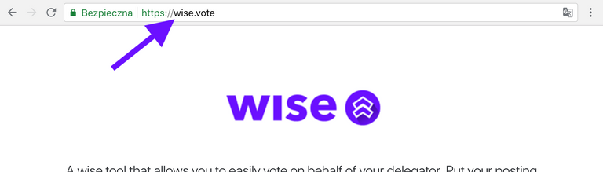
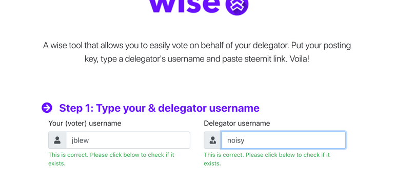
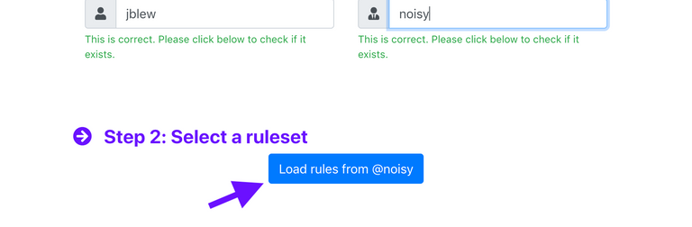
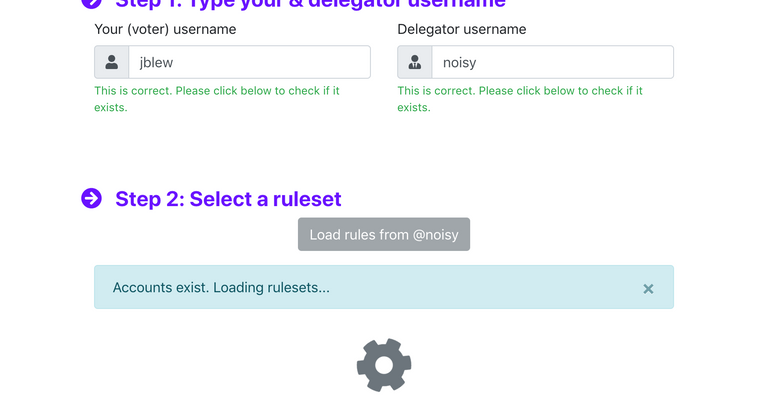
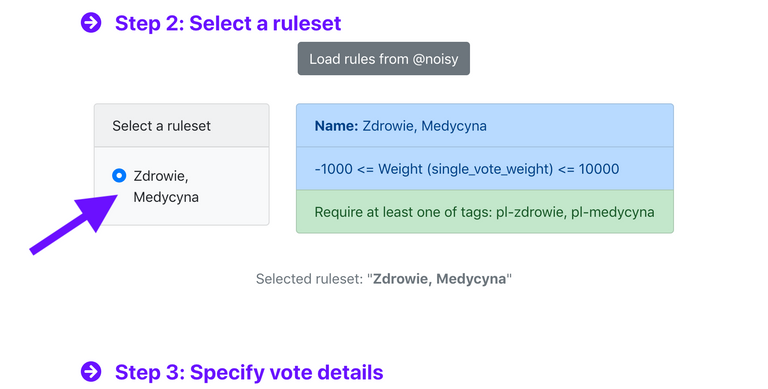
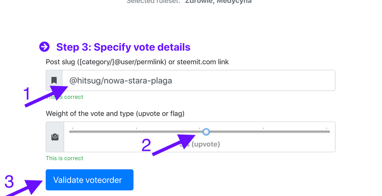
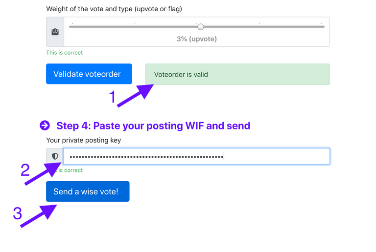

> W latach 2018-2019 pracowałem w startupie blockchainowym jako Architekt aplikacji wspomagającej delegowanie voting power na platformie Steem.
> 
> Od tego czasu wiele się zmieniło:
> 1. Ze względu na spadek ceny tej kryptowaluty zrezygnowaliśmy z prowadzenia startupu Wise
> 2. Doszło do próby przejęcia Steema przez firmę, która zakupiła Steemit (twórców blockchainu Steem)
> 3. Dzięki szybkiej i zorganiowanej akcji Witnessów Steem został przeniesiony na Hive
> 
> Ze względu na niestabilną sytuację i niepewną przyszłość Steem oraz Hive — zdecydowałem sie na przeniesienie treści z blockchainu na własną stronę internetową.

> Oryginalny post tu: https://hive.blog/polish/@jblew/wise-jak-glosowac-za-cudze-vp-a-takze-czym-jest-wise-i-dlaczego-powstal-czesc-pierwsza-cyklu-o-wise

Steem WISE to system delegacji głosów wymyślony przez @noisy, nad którym miałem przyjemność pracować. Chcę się podzielić swoimi spostrzeżeniami i przedstawić prostą instrukcję głosowania za pomocą WISE. W następnych częściach przedstawię instrukcję dla delegatorów, instrukcję pisania reguł, instrukcję developerską dla chcących korzystać z biblioteki, oraz guideline dla tych, którzy chcą włączyć się w projekt.

(Jeżeli interesuje Cię tylko instrukcja głosowania przewiń w dół :) )

## Jak działa WISE?

W skrócie: WISE umożliwia delegowanie głosu **pod ściśle ustalonymi kryteriami**.

Za chwilę podam przykład, ale żebyśmy się dobrze zrozumieli wprowadzę dwa pojęcia:

- delegator — osoba, która umożliwia użycie swojego głosu (deleguje głos, użycza go)
- głosujący — osoba, która wykorzystuje oddelegowane prawo głosu.

Przykładowo: wiesz, że @perduta jest ekspertem od blockchainu. Dzięki WISE możesz dać mu możliwość używania Twojego głosu:

- w bezpieczny sposób
- na ściśle określonych zasadach (post musi spełniać kryteria). W tym przypadku pozwolisz użyć swojego głosu tylko na posty posiadające tag #blockchain.
- w odpowiedniej ilości

**Jak to możliwe?** Co prawda dokładną instrukcję delegowania głosów przedstawię w następnym poście, ale już teraz mogę powiedzieć jaki jest mechanizm działania. Za pomocą WISE umieszczasz na blockchainie informację o tym pod jakimi warunkami delegujesz głos @perduta. Następnie uruchamiasz daemon WISE, który monitoruje blockchain w oczekiwaniu aż @perduta wyśle polecenie użycia Twojego głosu. Daemon sprawdzi, czy post na który chce zagłosować @perduta spełnia kryteria. Jeżeli tak — polecenie oddania głosu zostanie spełnione.

Prawdopodobnie trafiłeś na ten artykuł, bo ktoś otrzymałeś od kogoś delegację głosu. Pozwól zatem, że odpowiem na pytanie, które Cię nurtuje: czy głosowanie za pomocą WISE jest trudne? Nie! Specjalnie dla Ciebie przygotowaliśmy proste narzędzie https://wise.vote/ Oto instrukcja, jak z niego skorzystać:

## Jak głosować za pomocą https://wise.vote ?

Ktoś zdelegował Ci głos? Czas go wykorzystać. Pamiętaj, że delegacja to oznaka dużego zaufania, więc przemyśl i sprawdź dokładnie artykuł na który chcesz zagłosować cudzym głosem . Pamiętaj też, że dostałeś ten głos, aby go używać, więc nie bój się tego zrobić. Głos zawsze można cofnąć.

### 1. Wejdź na https://wise.vote ↑

### 2. Wpisz swój username i username osoby, która zdelegowała Ci głos ↑

### 3. Kliknij niebieski przycisk, aby załadować reguły, na mocy których możesz używać głosu, który dostałeś ↑

### 4. Chwilę potrwa ładowanie reguł

### 5. Teraz wybierz na mocy którego zestawu reguł będziesz głosował.

Delegator może umożliwić Ci głosowanie/flagowanie z różnym voting power z różnymi kombinacjami reguł.

### 6. Wklej link do steemit i wybierz wagę głosu.

1. Po wklejeniu linku zostanie on przekonwertowany do formatu "@author/permlink".
2. Wybierając wagę głosu pamiętaj, że dodatni procent oznacza upvote, a ujemny — flagowanie postu.
3. Kliknij "Validate voteorder" i poczekaj aż reguły zostaną sprawdzone. Musisz pamiętać, że oprócz tego, że reguły sprawdzane są przy głosowaniu — zostaną one sprawdzone po raz drugi na serwerze osoby delegującej zanim.

### 7. Wpisz SWÓJ posting key i kliknij w przycisk.

1. Jak widać w tym wypadku polecenie głosu było prawidłowe i wszystkie regułī zostały wypelnione. Może się zdarzyć, że post na który chcesz zagłosować nie spełnia kryteriów. Dostaniesz wtedy komunikat o błędzie.
2. Wklej swój posting key. Jest on potrzebny, bo polecenie głosu jest umieszczane na blockchainie jako custom_json w Twoim imieniu. Zostanie ono przechwycone przez serwer delegatora.
3. Kliknij w przycisk i poczekaj na pozytywny komunikat :)

### 8. Ciesz się z dobrze wykorzystanej możliwości

## Kilka słów o WISE
Chciałbym też przedstawić społeczny aspekt powstania i istnienia wise, oraz krótką jego historię.

### Dlaczego powstał WISE?
To pytanie należałoby zadać temu, kto wymyślił WISE — czyli Krzysztofowi @noisy. Żeby jednak mój tekst był kompletny, przedstawię swój punkt widzenia. Dla mnie Steem jest zjawiskiem niezwykłym, ponieważ zachowuje się jak samozarządzająca redakcja. W jaki sposób? Już tłumaczę! Dobra redakcja potrzebuje trzech rzeczy: (1) autorów, (2) redaktorów i (3) czytelników. Ned Scott i współpracownicy zaimplementowali mechanizmy, które napędzają "awans" w Steemie. Mechanizm głosów zachęca autorów do tworzenia dobrych treści, natomiast możliwość gromadzenia udziałów (vestów) daje władzę nad kształtem Steem i nad treściami, które się tu pojawiają. Tak powinno to wyglądać. Niestety, tak jak w klasycznej redakcji, (czy też np. parlamencie) osoby posiadające władzę zwykle nie posiadają odpowiedniej wiedzy. To powoduje, że dużo łatwiej jest propagować treści populistyczne niż merytoryczne. Jedno z rozwiązań tego problemu istnieje w świecie czasopism naukowych. W takich czasoposmach powołuje się ekspertów w danych dziedzinach jako tzw. board review. Ci eksperci oceniają przed publikacją czy artykuł jest wartościowy i wnosi nową treść w naukę. Naszym głównym celem jest stworzenie w Steemie podobnego rozwiązania.

**System ekspercki na Steemie.** Dzięki WISE osoby posiadające dużo udziałów, czyli władzę, czyli whales mogą bezpiecznie delegować swój głos osobom, które uważają za kompetentne w danym temacie. System reguł umożliwia doprecyzowanie zasad oddawania głosu. Najczęściej taka delegacja odbywa się poprzez ograniczenie dozwolonych tagów. Można więc powiedzieć, że whales będą powoływać ekspertów.

Społeczność Steema (a szczególnie whales) jest bardzo aktywna jeżeli chodzi o ciągłe podnoszenie jakości treści. Przykładem tego są akcje typu pręgierz lub temat tygodnia. Niestety możliwości człowieka są ograniczone i nie dość, że nie może posiadać wiedzy ze wszystkich dziedzin, to jeszcze ograniczony jest jego czas. Aby efektywnie moderować treści niektórzy whales musieliby czytać kilkaset artykułów dziennie. Jak widać w miarę rozrostu sieci — samodzielne moderowanie treści staje niemożliwe. To jest właśnie miejsce systemu eksperckiego, który jest możliwy dzięki WISE.

Chciałbym móc powiedzieć, że WISE jest rewolucją, ale ponieważ całkiem udana moderacja i czyszczenie tagów już istnieją — WISE jest ewolucją — jest narzędziem, które po prostu ułatwi i ulepszy już istniejące procesy.

## Jakie korzyści przynosi WISE społeczności?
System ekspercki — dla nas jest to najważniejsze zastosowanie WISEa. Umożliwi prawdziwą kurację treści na kształt czasopism naukowych.
Możliwość karania nieakceptowalnych zachowań.
Bardziej szczegółowe rozwiązania będą możliwe dzięki coraz większej ilości specyficznych reguł, oraz integracji z innymi narzędziami na Steem.

## Jakie korzyści przynosi delegatorom?
Spodziewamy się, że delegatorami najczęściej będą whales. Zapewne dla nich najbardziej będzie się liczyło podnoszenie jakości treści na Steemie, ale oprócz tego WISE przyniesie im też korzyści materialne. Aby prowadzić efektywną kurację (i nie marnować VP), osoba mająca głos o wartości kilkudziesięciu USD, musiałaby oddawać kilkaset głosów na dobę. Dzięki WISE whales mogą korzystać z większej ilości wolnego czasu i nie marnować voting power. Co więcej, mądrze rozdysponowane delegacje sprawiają, że rośnie rozpoznawalność osób delegujących.

## Jakie korzyści przynosi głosującym?
Osoby głosujące skorzystają na dwa sposoby. Przede wszystkim, jeżeli zagłosują na dany post jako pierwsze przed głosem delegatora — dostaną większą nagrodę za głos (tzw curation reward). Drugą (ważniejszą) korzyścią jest sam fakt bycia postrzeganym jako ekspert. Otrzymanie dużej ilości delegacji jest de facto dyplomem/tytułem, który przynosi prestiż i świadczy o profesjonalnej wiedzy. Głos wielu osób oznacza powszechne zaufanie. Dodatkowo Krzysztof prowadzi już rozmowy na temat integracji naszego systemu z innymi Steemowymi narzędziami. Liczymy na to, że pomoże to zwiększyć widocznosć głosów oddawanych przez ekspertów.

## Jak powstał WISE?
Ten ciekawy pomysł zrodził się w głowie @noisy — więc wcześniejszą część historii powinien opowiedzieć on. W moim życiu nadszedł szczególny moment — w lutym 2018, po półtora roku nauki, zdałem szczęśliwie egzamin z farmakologii. Na mojej uczelni jest takie powiedzenie, że jak zdasz anatomię, to wiesz, że będziesz lekarzem, ale dopiero jak zdasz farmakologię, to wiesz kiedy ;). Nauka do tego przedmiotu jest ciężka i intensywna, więc studia są tak zaplanowane, że po zdaniu farmakologii drugi semestr czwartego roku jest semestrem, w którym można po południu odpocząć (no, może pomijając blok z chorób zakaźnych). Zacząłem więc rozglądać się za jakąś pracą. Patryk @perduta namówił mnie do napisania CV. Wspaniale się złożyło, że spotkałem w tym okresie Krzysztofa @noisy, który pracował razem z Patrykiem. Krzysztof zaoferował mi pracę nad projektem Smartvotes (teraz WISE). Pomysł wydał mi się bardzo ciekawy i jestem szczęśliwy, że mogę pracować nad tym systemem.

Na początku plan był taki, że WISE napiszemy w pythonie. Jednak okazało się, że biblioteka steem-py w tamtym czasie miała sporo błędów i kiepską dokumentację. Z tego powodu postanowiłem, że cały system napiszemy w Typescripcie + Javascripcie. Zaletą takiego rozwiązania było to, że mogłem stworzyć wspólną bibliotekę dla przeglądarki i aplikacji serwerowych (np. daemona). Dodatkowo obecność w NPMjs ułatwia udostępnianie projektu i dzielenie się nim. W obecnym momencie jestem zadowolony z tego rozwiązania.

Bardzo się też cieszę, że zdecydowałem się na Typescript+Tslint, które pozwalają na uniknięcie wielu błędów dzięki dokładnemu śledzeniu zgodności typów i parametrów (co jest dużym problemem przy projektach korzystających z Javascriptu, które mają więcej niż kilka klas).

Na samym początku projektu postanowiłem też, że stworzę odpowiednie środowisko do testowania biblioteki. Napisałem 150 testów jednostkowych i FakeBlockchainApi, które umożliwia testowanie wielu funkcji biblioteki bez wykonywania zapytań do steemd. Pozwoliło to wykryć większość błędów już na etapie pisania biblioteki i ułatwiło rozwój aplikacji w późniejszych stadiach.

Muszę przyznać, że poświęciłem na napisanie biblioteki, CLI i voter-page bardzo dużo czasu, ale jestem z tego zadowolony. Było to dla mnie oderwaniem od szpitalnych korytarzy. W sumie projekt zajął mi około 300 godzin pracy. Dodam tutaj, że jesteśmy w zasadzie witnessowym startupem i działamy z poczucia wspólnoty ze steemianami (a szczególnie Krzysztof, o czym wielu z Was, czytelników, doskonale wie). Dlatego chcemy pokornie prosić o wsparcie w postaci głosów na @noisy.witness. W ten sposób umożliwicie nam dalszą pracę nad tym i kolejnymi projektami a być może nawet zaangażowanie większej ilości osób. Powiem szczerze, że osobiście jestem bardzo wkręcony w ten projekt i chętnie będę pracował dalej nad jego rozwojem.

## Roadmap
Już osiągnięte:

- Specyfikacja protokołu WISE
- Biblioteki steem-wise-core
- Narzędzia CLI do głosowania (steem-wise-cli)
- Przeglądarkowej aplikacja do głosowania (https://wise.vote)
 
### Roadmap na przyszłość (w kolejności):

1. Integracja ze Steem Connect
2. Stworzenie materiałów edukacyjnych
3. Rozszerzenie dla przeglądarek ułatwiające głosowanie
4. WISE Platform (dla osób, które nie chcą samemu uruchamiać daemona)
5. Block explorer dla WISE
6. Integracja z innymi narzędziami w sieci Steem

## Na zakończenie
To jeszcze nie koniec artykułu. W następnych częściach przedstawię:

- Instrukcję uruchamiania daemona
- Instrukcję korzystania z narzędzia CLI
- Instrukcję pisania reguł
- Manual dla developerów chcących używać biblioteki steem-wise-core w swoim projekcie
 

*Dziękuję,
Jędrzej Lewandowski*

***
***

> Tekst był opublikowany w kanale #pl-wise

## Komentarze — kopia komentarzy z blockchainu steem

> **perduta**
> Dobra robota Jędrzeju.
> Powodzenia na sesji!

> **adasq**
> Delegacja głosu domyślnie jest jednorazowa (1 reguła -> jeden głos)?
> 
> Szkoda, że po tym pierwszym poście nie można z tego jeszcze skorzystać (bo jak zrozumiałem brakuje UI do tworzenia reguł chyba, że skorzystałbym z CLI?).
> 
> Nie mniej jednak - czuję wartość tego, nad czym pracujecie. Będę obserwował rozwój projektu i czekam na kolejne wpisy.

> **noisy**
> > Delegacja głosu domyślnie jest jednorazowa (1 reguła -> jeden głos)?
> Nie. Obecnie tak długo, dopóki reguła nie jest wyłączona, tak długo obowiązuje. Na razie zostały zaimplementowane bazowe reguły jak restrykcje co do tagów czy autora, kolejne reguły czekaja do implementacji:
> 
> https://github.com/noisy-witness/steem-wise-core/issues
> 
> Będziemy implementować te, które będą najbardziej porządane przez społeczność
> 
> > Szkoda, że po tym pierwszym poście nie można z tego jeszcze skorzystać
> 
> Można. Wszystko co jest potrzebne jest już dostępne w naszych repozytoriach: https://github.com/noisy-witness/
> 
> > bo jak zrozumiałem brakuje UI
> Zgadza sie, brakuje. UI do tworzenia reguł bedzie docelowo w "Wise Portalu".
> 
> Postanowiliśmy oficjalnie ruszyć z projektem zaledwie dysponując CLI, gdyż to pozwala nam już testować cały projekt... 2-3 miesiace zacznim Wise Portal będzie skończony.
> 
> > Będę obserwował rozwój projektu i czekam na kolejne wpisy.
> Polecam podglądanie naszych prac na githubie, czy też nawet aktywną pomoc :)

> **monterski**
> Hej. Nie minęło dużo czasu a WISE już działa. Mam nadzieję że będzie to jakieś rozwiązanie by wypromować wartościowe treści. Idea jest słuszna i pomysł świetny:)

> **jblew**
> Dużo i niedużo. My pracując zdążyliśmy się już z nim zżyć ;) Na razie to jest dopiero MVP, więc mam nadzieję, że kiedy już będzie pełna platforma, to uda się zdziałać dla Steema naprawdę dużo dobrego :D

> **noisy**  
> Na razie to jest dopiero MVP
> 
> Przyznam szczerze, że osobiście jestem zadowolony, z tego jak to MVP wyszło :)
> 
> 80% wartości projektu jest dostarczone, za pomocą stworzenia 20% funkcjonalności :)
> 
> Teraz możemy pracować nad resztą potrzebnych rzeczy, ale możemy robić to, mając świadomość, że projekt już jest używany... a nowe funkcjonalności uwzględniają uwagi od realnych użytkowników :)
> 
> Jak do MVP podszedłem kiedyś... można poczytać w artykule, który kiedyś na Steem opublikowałem :)
> 
> How I bankrupt my first startup by not understanding the definition of MVP - Minimum Viable Product
>

> **tomii**
> Witam, jestem tutaj krótko i rozpoczynam przygodę, ale dzięki takim informacją jak te poznaje codziennie coś nowego. Zainteresował mnie temat więc go dogłębnie przeanalizuje. Dzięki.

> **breadcentric**
> Szanuję bardzo!

> **alcik**
> Mam nadzieję, że pierwsza (na roadmapie) pozycja integracji ze Steem Connect jest nieprzypadkowa. Wydaje się, że w polskiej społeczności @noisy cieszy się odpowiednim poziomem zaufania, ale to jest moim zdaniem "must have" zanim będziecie publikować informacje o tym projekcie całej społeczności Steemit (czy już to zrobiliście?).

> **bartosz546**
> > FakeBlockchainApi
> Mógłbyś wyjaśnić co dokładnie masz na myśli?