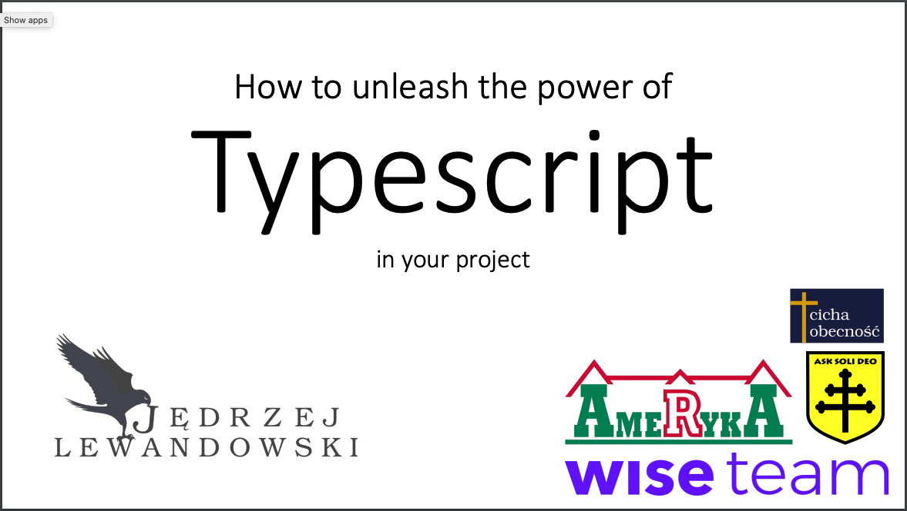
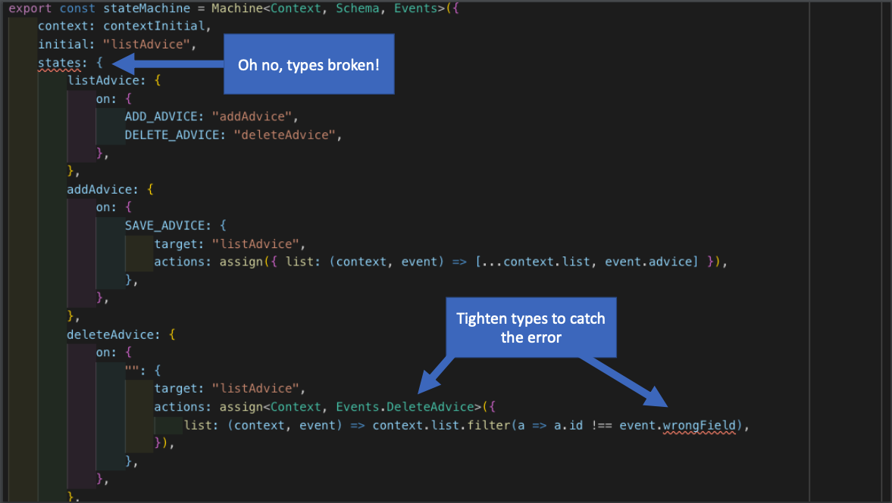

Typescript to wspaniałe narzędzie, które uzupełnia dobrze prowadzony projekt JS z testami jednostkowymi i E2E o ostatni (a właściwie pierwszy) element układanki — statyczne typowanie. Przemyślane typowanie pozwala wykorzystać potencjał Typescriptu bez narażania się na dodatkowe koszty. 
<!--more-->

Ten wykład wygłosiłem jako kontrę do popularnego ostatnio stwierdzenia, że "Typescript wiąże się z większymi kosztami niż zyskami z typowania". Przedstawiam w nim m.in. sposoby na zapobieganie trudnym do debugowania komunikatom błędów w Typescript.

[Kliknij aby obejrzeć slajdy](/infomeet19-typescript-keynote-1.0.0.pdf)

