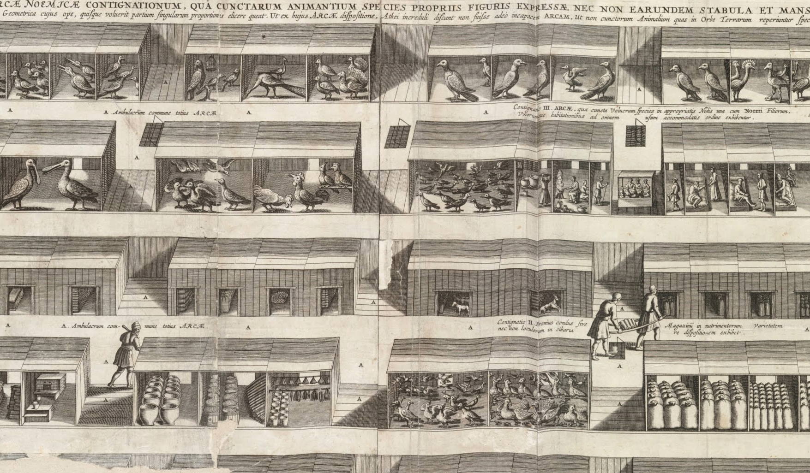

*"Czy Jezus mógł mieć rację?"*, *"Nowe rynki warte miliardy dolarów — eksperci nie mają wątpliwości"*. *"Dolina Krzemowa na tropie filozofii Jezusa Chrystusa"*. 

 
Nagłówki, których dotychczas nie napisał nikt. A powinien. Rewolucja "love driven design" przybiera na sile. Wystarczy postępować według Pisma Świętego. 

 
Jestem trochę zły. Dlaczego my chrześcijanie, znając te nauki od ponad 2000 lat, nie zarobiliśmy tych miliardów? Jak wiele dobra moglibyśmy dzięki nim uczynić?

 
Zanim przejdziemy do tematu pieniędzy czy miłości, przemyślmy te 2000 lat, które minęły od zamiany Sprawiedliwości na Miłosierdzie Boże. Bądź cierpliwy czytelniku. Słowo Jezusa zaczekało 1970 lat, żeby zasiać  to ziarno, o którym Ci opowiem. Pozwól więc, że ja też nadwyrężę Twoją cierpliwość.

<!--more-->

*Ten artykuł napisałem dla e-czasopisma katolickiego Siejmy. [Link do całego numeru, mój artykuł na końcu](https://siejmy.pl/2020/05/siejmy-kwiecien-maj-2020/)*

> *Gdy zaś przyjdzie to, co jest doskonałe,*
> *zniknie to, co jest tylko częściowe* 
>
> ​						— Hymn o Miłości, werset 10

## Część 1 — przegapiliśmy nową epokę historyczną. Przegapimy następną

> *Teraz widzimy jakby w zwierciadle, niejasno;*
> *wtedy zaś [zobaczymy] twarzą w twarz*
>
> ​						— Hymn o Miłości, werset 12

Powszechnie uważa się, że żyjemy w epoce nazywanej "Czasami najnowszymi". Jednak epoka ta zakończyła się w latach 70.

### Historia rozwija się skokami. 

"Przeszłość jest prologiem" — głosi tytuł najnowszej książki Jacka Bartosiaka. Zdaje się jednak, że epoka historyczna, która nadchodzi, będzie niepodobna do żadnej z poprzednich. Epoka "czasów postnajnowszych" trwająca od lat 70 XXw. zagościła na dobre. Trwa już od 50 lat. Wygląda na to, że większość z nas jest nieświadoma przeskoku społecznego, który się wtedy dokonał. 

Niedobrze. Jeżeli nie zauważyliśmy nowej epoki powstałej w latach 70, to tym bardziej możemy przegapić początek kolejnej. 

Historię wynalazków zwykliśmy rozpatrywać stereotypowo: poprzez pryzmat  jednostkowych udoskonaleń. Oddalmy trochę swój wzrok i zastanówmy się nad historią świata w kontekście nurtów filozofii. Jakie nurty rządziły poszczególnymi epokami? Jaki był ich stosunek do człowieka?

Historię tworzą ludzie. Historię piszą ludzie — możemy powiedzieć, że wszystkie epoki były skupione na człowieku. Homocentryczne. Nawet średniowiecze. Jednak każda z nich na swój sposób. Dlaczego? Dlatego, że każda z nich pojmowała człowieka poprzez inny aspekt człowieczeństwa, jednocześnie uznając dany aspekt za najważniejszy.

### Epoka każda, homocentryczna.

Zacznijmy od **średniowiecza**, początku świata nowożytnego. Islam blokuje Lewant, zamykając komunikację między światem Wschodu i Zzachodu na wiele setek lat [6]. Trwa VII wiek. Oprócz recesji ekonomicznej powoduje to także blokadę przepływu idei, filozofii, ze świata wschodniego do naszego — zachodniego.

Europa zaczyna myśleć sama. Po raz pierwszy od upadku świata starożytnego. Najważniejsze osiągnięcie średniowiecza to metoda naukowa: zaczynając od Św. Augustyna z Hippony, który ugruntował uniwersalizm prawdy i poznania. Skutecznie zmarginalizował antynaukowy sceptycyzm (powracający do nas dopiero w latach 30 XX wieku). Największy wkład wnieśli średniowieczni scholastycy, którzy uformowali pięć wielkich filarów metody naukowej, stosowanych do dziś - nigdy ich nie podważono. Nie udało się to nawet postmodernistom. 

Kolejna zdobycz średniowiecza: struktura korporacyjna stworzona przez kościół, będąca skokiem zdolności organizacyjnej ludzi [2]. 

Wreszcie doniosłe osiągnięcie tworzące proste szyny dla rozwoju nauki — uniwersytety, czyli zdolność do organizowania się ludzi nauki.

Możemy zatem podsumować, że średniowiecze rozwijało świat głównie w kontekście społeczno-filozoficznym. Patrzyliśmy na świat przez pryzmat prawdy. Tego, czym ona jest i czy ona jest. Natomiast na człowieka — przez pryzmat jego relacji z tą prawdą, a więc na jego duszę. Czyli: średniowiecze — **spirytocentryzm** 

**Renesans** również stawiał człowieka w centrum. Zaczęły pojawiać się wielkie odkrycia geograficzne i przyrodnicze. W nauce rozpoczął się kult umysłu. Filozofowie renesansowi odcinali się od średniowiecza uważając je za nienaukowe. Prawda jest jednak taka, że filozofia nauki renesansowej skupiła się na praktycznym wykorzystaniu metody naukowej, stworzonej dzięki średniowiecznej metafizyce. Mówi się o przejściu od metafizyki do episteomologii (poznawania). W myśli filozoficzne od dedukcji do indukcji. Odkrywaliśmy wszystko to, co dało się zaobserwować gołym okiem, skrzętnie opisywaliśmy. W centrum zainteresowania leżał świat otaczający człowieka. Relacje środowiska z człowiekiem. Renesans — **habitocentryzm**. Narzędziem, jakie renesans zostawił kolejnej epoce były: indukcja naukowa oraz powiązana z nią metoda eksperymentalna.

Oddzielenie nauk ścisłych od filozofii, teologii i nauk humanistycznych to domena **baroku**. W pełni wykorzystano indukcję naukową nie tylko w naukach przyrodniczych. Filozofia baroku to badania nad ekonomią, państwami, władzą. Upowszechnia się druk pod postacią regularnie wydawanej prasy, co prowadzi do przyspieszonego rozprzestrzeniania idei. Narzędzia, jakich barok dostarcza kolejnej epoce, (choć sam ich w pełni nie wykorzystuje) to pedagogika, psychologia i nauki społeczne. Ich stworzenie było możliwe tylko dzięki zastosowaniu indukcji naukowej na szeroką skalę. Myśl naukowa zaczęła przeć w kierunku poprawy bytu grup ludzi i relacji człowiek-społeczeństwo, co możemy nazwać **socjocentryzmem**

Athanasius Kircher. Układ Arki Noego z "Arca Noe in tres libros digesta". 1675. Vilnius University Library. Credit: Google arts and culture.

Dla większości ludzi żyjących w epoce **oświecenia** najbardziej dostrzegalną zmianą była rewolucja przemysłowa. Pojawiła się zdolność panowania nad przyrodą. Skupiliśmy się paradoksalnie na centralizacji władzy — władzy nad przyrodą i ludźmi. Ostatecznie doprowadziło to do gwałtownego wzrostu poczucia nierówności społecznej, prowadząc do olbrzymich tarć, z rewolucją francuską na czele. Zaczęto rozwijać ekonomię poprzez zastanawianie się nad podziałem dóbr. Powstały podwaliny wielkich teorii takich jak marksizm. Stosunek do człowieka w oświeceniu możemy nazwać **regulocentryzmem**. Traktujemy człowieka, tak jak i przyrodę, jako zasób mogący wytworzyć określoną ilość dóbr.

| Epoka                  | Zmiana filozofii                    | Narzędzie przekazane następnej epoce     | Człowiek                      |
| ---------------------- | ----------------------------------- | ---------------------------------------- | ----------------------------- |
| Średniowiecze          | Poszukiwanie podstaw przez dedukcję | Metoda naukowa                           | Dusza - spirytocentryzm       |
| Renesans               | Epistemologia: opisywanie świata    | Indukcja                                 | Otoczenie - habitocentryzm    |
| Barok                  | Przeprowadzanie eksperymentów       | Pedagogika, psychologia, nauki społeczne | Społeczeństwo - socjocentryzm |
| Oświecenie i romantyzm | Panowanie nad przyrodą              | Ekonomia, wielkie teorie                 | Władza - regulocentryzm       |
| Czasy najnowsze        | ?                                   | ?                                        | ?                             |

### Czasy najnowsze *RIP

Epoka, która nastąpiła później nazywana jest "**czasami najnowszymi**". Powszechnie uważa się, że epoka ta trwa nadal. To przekonanie jest błędne.

 Czasy najnowsze" skończyły się w latach 70. Dlaczego? Wyjaśnię w dalszej części artykułu. 

Epoka "czasów najnowszych", rozpoczęta I wojną światową, została zdominowana przez myśl ekonomiczną opartą o podział dóbr. Zarówno kapitalizm jak i komunizm, chociaż pozornie przeciwstawne, skupiały swoją myśl na tym, żeby opracować "zasady podziału dóbr". Założyły, że dobra są limitowane, że istnieje skończona ilość rynków, że "gramy w grę o sumie bliskiej zerowej". Patrząc w ten sposób dostrzegamy, że komunizm i kapitalizm popełniają ten sam błąd — stawiają znak równości między sumą dóbr a "wartością". 

Tym, co motywuje mnie do pisania artykułu, jest właśnie przekonanie, że wszyscy powinnyśmy być świadomi tego błędu. Musimy bardzo dobrze zrozumieć, czym różnią się takie pojęcia jak: "dobra", "wartość" i "osoba" — te koncepcje, chociaż wypracowane w w epoce "czasów najnowszych" — nie zostały ani docenione, ani tym bardziej zrozumiane. Stanowią jednak podwaliny pod nową epokę. Zadajmy sobie pytanie: kiedy żyjemy?

Aby dopełnić obrazu epoki, brakuje nam jeszcze tylko określenia stosunku do człowieka. Znakiem rozpoznawczym tamtych czasów są wielkie osobiste kariery, "osobiste marki", spektakularne ścieżki od biedy do posiadania multimilionowych kapitałów. Kult jednostek — aktorów, polityków, biznesmenów, także kapłanów. Z tego względu możemy powiedzieć, że w sferze stosunku do człowieka króluje — **egocentryzm**. 

Uprzedzając polemikę argumentującą, że kult jednostek istniał od zawsze: aby udowodnić, że to nie jest prawda, przytoczę wstęp o. prof. Emila Kumki OFMConv do wydania "Medytacji o życiu Chrystusa" Świętego Bonawertury:

> *"Nie zaskakuje więc, że dzieło to zostało przypisane świętemu Bonawenturze, pamiętając, iż w średniowiecznych kodeksach prawie zawsze pomijano imię twórcy, a po pewnym czasie przypisywano ojcostwo wybitnemu autorowi na podstawie kryterium analogii treści".*

| Epoka                   | Zmiana filozofii                    | Narzędzie przekazane następnej epoce         | Człowiek                      |
| ----------------------- | ----------------------------------- | -------------------------------------------- | ----------------------------- |
| Średniowiecze           | Poszukiwanie podstaw przez dedukcję | Metoda naukowa                               | Dusza - spirytocentryzm       |
| Renesans                | Epistemologia: opisywanie świata    | Indukcja                                     | Otoczenie - habitocentryzm    |
| Barok                   | Przeprowadzanie eksperymentów       | Pedagogika, psychologia, nauki społeczne     | Społeczeństwo - socjocentryzm |
| Oświecenie i romantyzm  | Panowanie nad przyrodą              | Ekonomia, wielkie teorie                     | Władza - regulocentryzm       |
| Czasy najnowsze         | **Tworzenie i podział dóbr**        | **Decyzje oparte o dowody (evidence-based)** | **Jednostka - egocentryzm**   |
| **Czasy postnajnowsze** | ?                                   | ?                                            | ?                             |

### Czasy postnajnowsze

Zastanawiasz się, jak będą nazywane kolejne epoki. Czasy postnajnowsze? Może neonajnowsze? A może po prostu będziemy numerować epoki historyczne. Choć jest to szalenie ciekawa kwestia, skupię się na pytaniu — dlaczego żyjemy w kolejnej epoce? Po czym poznać zmianę epoki? W jaki sposób czasy postnajnowsze różnią się od najnowszych?

Istnieje zaskakująco duży arsenał narzędzi do oceny historii. Analizujemy ją, przyglądając się działalności człowieka w różnych aspektach.  Powszechnie uznany podział na epoki jest podziałem arbitralnym. Opiera się na tzw. "podziale naturalnym", co oznacza, że bardzo wiele osób umieści linię podziału w tym samym miejscu. Eksplorując słowo "naturalny" w kontekście istniejącego podziału odkrywamy, że tak naprawdę historia rozwija się skokowo. Tzn możemy wyznaczyć określone punkty, gdzie w bliskim sąsiedztwie czasowym (nieomal jednocześnie) zmieniło się wiele aspektów życia człowieka. Postanowiłem wybrać te najbardziej znamienne (i konieczne do przyjęcia koncepcji love driven design): (1) filozofia względem rzeczywistości, (2) postrzeganie człowieka, (3) zdolność organizowania się ludzi w grupy oraz (4) ...wnioski z analizy Pisma Świętego.

**Filozofia względem rzeczywistości** — każda z wyżej wymienionych epok historycznych różni się podejściem do fundamentalnych kwestii, takich jak: istnienie Boga, uniwersalność prawdy, poznawalność świata, główny kierunek wyciągania wniosków (indukcja a może dedukcja), możliwość wyboru teorii.

**Postrzeganie człowieka** — każda z epok uznaje inny aspekt człowieczeństwa za  "najbardziej człowieczy". W każdych czasach coś innego "czyni nas ludźmi".

**Zdolność organizowania się w grupy** — Laloux w swojej książce "Reinventing organizations" wyznacza dokładne punkty, kiedy skokowo, zmieniała się zdolność ludzi do organizowania się w grupy. Powstała teoria kolorów organizacji, znany podział na czerwone, bursztynowe, pomarańczowe, zielone, z których każda kolejna reprezentuje skok cywilizacyjny. W stosunku do czerwieni, bursztyn wprowadził formalne role i planowanie długoterminowe oparte o procesy. Pomarańcz zamienił dawny podział oparty na rolach społecznych (mam niebieski mundur więc jestem kolejarzem) na merytokrację (umiem napisać program komputerowy, więc jestem programistą). 

**Wnioski z analizy Pisma Świętego** — dlaczego wnioski z analizy Pisma Świętego mogą wskazywać na skok kulturowy? Biblia jest fenomenalnie dobrym modelem zmiany myślenia! Księgi Pisma Świętego nie zmieniały się od conajmniej 1800 lat. Jednocześnie, przez te 1800 lat podlegały nieustannej analizie i wciąż na nowy wyciągano z nich wnioski. Każdemu przeskokowi między epokami towarzyszyła gwałtowna zmiana rozumienia i przeniesienie akcentów. Każda epoka inaczej interpretowała to samo Święte Słowo. Jak pisał kard. Ratzinger: "Jeśli studium źródeł wnosi nagle zupełnie nowe impulsy, jest to zawsze znakiem przemian dokonujących się w ludzkiej świadomości."[3].

Zastosujmy zatem analizę w tych czterech znacznikowych obszarach do porównania "czasów najnowszych" i "czasów postnajnowszych". 

**Filozofia względem rzeczywistości**:

1. Na przełomie lat 60. i 70. dochodzi do ponownego **połączenia nauk przyrodniczych z humanistycznymi**. Gauch wymienia rok 1968 jako rok zwrotny w tej kwestii. Napisano wówczas dwie przełomowe książki [4], które doprowadziły do powrotu "filozofii metody naukowej" na salony nauki. Stało się to w dużej mierze z powodu gwałtownego rozwoju statystyki. Coraz bardziej złożone metody statystyczne nie są już intuicyjne. Sam fakt zmiany (pozornie dobrze dobranej) metody daje odmienne rezultaty. Teraz trzeba rozpatrywać problem z punktu widzenia filozoficznego, żeby móc prawidłowo zastosować do niego metody matematyczne.
2. Drugim przełomem jest postrzeganie świata przez pryzmat "**odpowiedzialności**" człowieka. Już nie rządzimy, już nie wykorzystujemy natury. Teraz za nią "odpowiadamy". Wykładnikiem jest upowszechnienie się ruchów ekologicznych. Przełom w tej kwestii nastąpił w latach 60 i 70. w prasie naukowej. Przełomowy był artykuł, który Gilbert Plass opublikował w Scientific American w 1959 r., stwierdzając w nim, że globalna temperatura podniesie się do końca wieku o 3°C. Doprowadziło to do naukowej debaty zwieńczonej powołaniem w 1988 roku Międzyrządowego Zespołu ds. Zmian Klimatu [5]
3. Wreszcie trzecim przełomem jest ukonstytuowanie się przekonania o **powszechnej sprawiedliwości**. Wśród ludzi na świecie zaczął królować pogląd o tym, że świat tworzony przez ludzi jest zasadniczo sprawiedliwy, co sprawiło, że zaczęto z wielką siłą tępić niesprawiedliwości — Amnesty International powstało w 1961 roku, a w 1977 otrzymało Pokojową Nagrodę Nobla. Także dekolonizacja rozpoczęła się w 1960 roku i główna jej realizacja przypadła właśnie na lata 70.

**Zdolność organizowania się w grupy** — powstawanie tzw. organizacji zielonych i turkusowych (wg. teorii kolorów Laloux). Zielone — pracownik jest współwłaścicielem sukcesu i współtwórcą "wartości". Turkusowe — to pracownicy są jedynymi właścicielami firmy. Są to tzw. firmy samozarządzające, tj. członkowie zespołu sami dzielą się zadaniami w obrębie swojej grupy oraz sami wyznaczają cele.

**Wnioski z analizy Pisma Świętego** — Ratzinger [3] opisuje rewolucję, która nastąpiła w Eschatologii. Ta rewolucja również przypada na lata 70. Ówczesny kardynał, a przyszły papież cytuje niemieckiego teologa H. U. von Balthasara, (praca z 1964 roku): "Eschatologia to miejsce na choryzoncie teologii, z którego nadciąga burza". Tą burzą stało się przeniesienie akcentu nauczania Kościoła z wyznaczania dobrych praktyk dnia codziennego na pełne nadziei spojrzenie w kierunku spraw ostatecznych. **Życie doczesne w nauczaniu ustąpiło miejsca pedagogice życia wiecznego**. Takoż, samo orędzie Jezusa, zamiast jako wzór godnego życia, zaczęło być interpretowane jako zapowiedź Królestwa Bożego. Zmiana ta jest jednocześnie kolosalna i niezauważalna wobec krzykliwych debat moralnych naszych czasów. Warto się nad nią zastanowić.

**Postrzeganie człowieka** — tutaj leży clue niniejszego artykułu. Bo to właśnie zmiana w pojmowaniu *człowieczeństwa* przez człowieka doprowadziła do największych zmian naszej epoki. Zmiana pojmowania człowieczeństwa  To właśnie zmiana kąta patrzenia na człowieczeństwo - doprowadziła do powstania firm typu startup, pojęć takich jak innowacja czy kreowanie wartości.

### Jakie narzędzia damy następnej epoce?

Widzisz, krótka analiza skoku cywilizacyjnego wskazuje lata 70. jako moment przełomu. To oznacza, że czasy postnajnowsze trwają już co najmniej od 50 lat. Z tego powodu warto podkreślić, że być może jesteśmy już w połowie albo wręcz bliżej końca tej epoki historycznej. Nie jest to popularny temat. Futurolodzy skupiają się raczej na problemach tego, czy wzrost technologiczny będzie skończony czy nieskończony. O wiele potrzebniejsze wydają się wszakże analizy skoków społeczno-filozoficznych. Bo to one dają nam narzędzia pozwalające tworzyć nowe technologie. Warto spojrzeć na nadchodzące lata jako na zbliżający się kolejny przeskok cywilizacyjny. 

Zachęcam do jeszcze jednego wysiłku. Jak przedstawiłem to wyżej, w tym krótkim wprowadzeniu — każda epoka wytwarza pewien zestaw nowych narzędzi (jak np. metoda naukowa, teoria organizacji, sądownictwo). Jednak epoka dostarczająca narzędzi sama nie korzysta z niego wcale bądź korzysta, lecz nie wykorzystujejego  potencjału w pełni. W tym artykule opisuję narzędzia socjologiczne, ale te narzędzia powstają też w sferze techniki, teologii czy w sztuce. 

>  Narzędzia, które posłużą do budowy przyszłej epoki — powstają już dziś.

Najważniejsze z tych narzędzi tworzy na naszych oczach — **love driven design** (projektowanie oparte o miłość). Jest to tak naprawdę zestaw różnych technologii projektowania i tworzenia innowacji, które stają się modne i są źródłem sukcesu wielu firm typu startup. Mówię o pojęciach takich jak chociażby Design Thinking czy UX. Wszystkie te technologie spaja fakt, że traktują człowieka w kontekście "osoby", a innowacje powstają poprzez miłość do człowieka (najczęściej konkretnego, udowodniono, że to działa najlepiej!). Ta miłość, pełna zrozumienia, współczucia powoduje tworzenie nowej  "wartości" w życiu osoby. 

> Gdybym [...] znał wszystkie tajemnice,
> i posiadał wszelką wiedzę, [...]
> **a miłości bym nie miał,**
> **byłbym niczym**.
>
> ​						— Hymn o Miłości, werset 10

Powyższy cytat jest trafnym testem przesiewowym sukcesu współczesnych startupów. Ok. 59% z nich upada, bo nie potrafią się do niego zastosować. Jest to podstawowy wymóg tworzenia innowacji w naszych czasach. Ci, którzy dostrzegli zmianę skorzystali. Ci, których miłość do bliźnich prowadzi przez życie mogą w tych czasach bezpiecznie wejść do biznesu. Natomiast firmy żyjące poprzednią epoką, epoką kultu ego bądź władzy, upadają. Upadają, bo nie wnoszą wartości w życie ludzi. Nie wnoszą wartości, bo ich nie kochają.

W kolejnej części artykułu opiszę dokładnie jakie techniki składają się na love driven design (a przynajmniej te, które znam, bo lista nie jest zamknięta i każdą jeszcze nietkniętą sferę przemysłu można będzie transformować rewolucją miłości). Skupię się też na pojęciach niezwykle trudnych — "czym jest osoba", co to jest "wartość".

Do usłyszenia,
Jędrzej

Athanasius Kircher. Maszyna deszyfrująca z "Magnes sive de arte magnetica opus tripartitum". 1643. Vilnius University Library. Credit: Google arts and culture.

### Bibliografia 

[1] Huhg G. Gauch Jr "Scientific method in brief"

[2] Frederic Laloux "Reinventing Organizations"

[3] Joseph Ratzinger "Śmierć i życie wieczne"

[4] Sir Karl Popper "The Logic of Scientific Discovery" i C. P. Snow "The Two Cultures and the Scientific Revolution"

[5] Mark Maslin. “Zmiany klimatu. Krótkie wprowadzenie”

[6] Jacek Bartosiak "Przeszłość jest prologiem"

[7] Biblia Tysiąclecia

[8] Wstęp o. prof. Emila Kumki OFMConv do wydania "Medytacji o życiu Chrystusa" Świętego Bonawertury z 2019 roku (wydawnictwo M)

***

> To jest tryptyk. Chcesz przeczytać drugą czesć? [Druga część jest tu]()