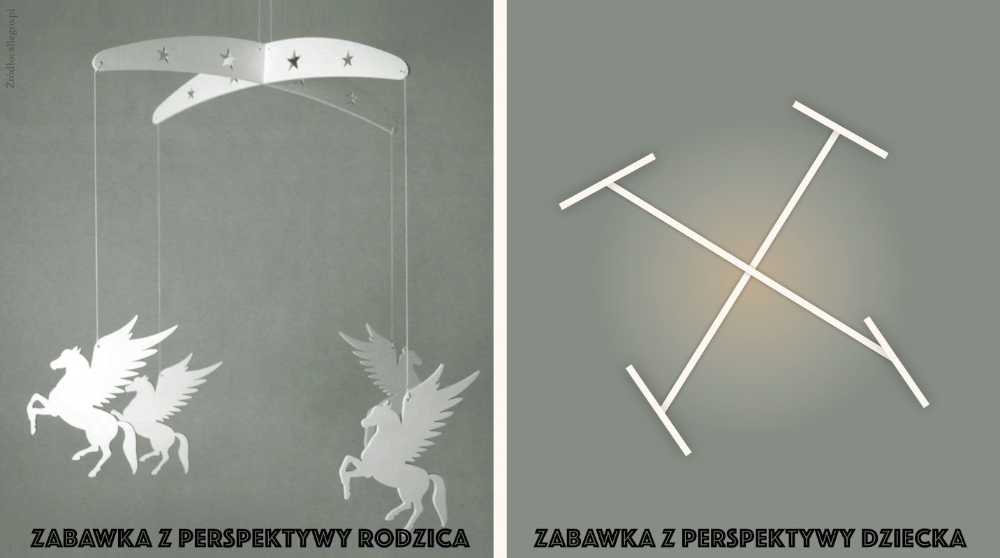

Nadchodzą czasy, kiedy ewangelia będzie głoszona po całej ziemii, a Miłość będzie fundamentem naszej kultury. Weźmiesz udział w przygotowaniach?

 
*Ten artykuł napisałem dla e-czasopisma katolickiego Siejmy. [Link do całego numeru, mój artykuł na końcu](https://siejmy.pl/2020/10/siejmy-6-2020/)*
<!--more-->

> To jest trzecia część artykułu: [Pierwsza część]() [Druga część]()

## Apokalipsa

Obecnie panuje bardzo trudny czas dla Kościoła i Chrześcijan. Ewangelia i Apokalipsa przygotowywały nas na ten wielki ucisk. Te święte księgi piszą również o wspaniałych czasach nadziei, które nadejdą po ucisku. O ucisku mówi się wiele. A jak słyszymy o nadziei?

Ewangelia i Apokalipsa mówią, że w historii świata po okresie ucisków nadejdzie moment, kiedy znów zatryumfuje Bóg i Miłość.

 Św Mateusz pisze: 

> Ewangelia o królestwie będzie głoszona po całej ziemi, na świadectwo wszystkim narodom. I wtedy nadejdzie koniec
> 	— Mt 24,14

Ten sam sens wyrażony innymi słowami odczytamy w księdze Apokalipsy. Zanim jednak do niego przejdę, to wyjaśnię istotę apokalipsy jako księgi. Dlaczego i dla kogo została napisana apokalipsa?

Apokalipsa została dana Kościołowi aby przeprowadzić go przez trudne czasy między Wniebowstąpieniem a powtórnym przyjściem Chrystusa, żeby wskazać kierunek i pokrzepić nas nadzieją. Niewiele osób zdaje sobie z tego sprawę, że Apokalipsa tak naprawdę opisuje warstwę Duchową historii naszego świata. Od stworzenia do końca (a więc także przyszłość). Choć nie wiemy co i kiedy dokładnie się zdarzy w naszym pojmowaniu (nie znamy kataklizmów, wojen, etc), to z apokalipsy możemy dokładnie odczytać kolejność rozwoju duchowej sytuacji na świecie. Opisuje ona nam dokładnie co po kolei dzieje się w sferze duchowej w kościele, co się dzieje w świecie pogan, jakie formy przybiera zło w poszczególnych epokach. Możemy w przybliżeniu odkryć moment, w którym się znajdujemy oraz co nastąpi dalej.

Ponieważ sama księga apokalipsy jest owiana wieloma kontrowersjami i mitami, to zanim opiszę moment, w którym znajduje się nasz świat teraz, zaznaczę, że wszystkie analizy tekstów Apokalipsy pochodzą z książki Marii Szamot "Apokalipsa czytana dzisiaj". Metodologia odczytywania Apokalipsy jest opisana we wstępie do tej książki. W skrócie opiera się na tym, że symbole używane w Apokalipsie (takie jak Królowie ze Wschodu, Książeczka, Baranek, Wielkie Miasto, Rzeka Eufrat, etc) po pierwsze mają to samo znaczenie co w Piśmie Świętym, a po drugie mają to samo znaczenie w całej Apokalipsie (nie zmienia się ono w zależności od kontekstu). Więcej szczegółów opisano w Książce. A my wróćmy do warstwy duchowej świata doczesnego — jak daleko zawędrowaliśmy w Bożym Planie Zbawienia?

### Piąta plaga

Obecnie znajdujemy się w okolicy piątej plagi. Co dzieje w piątej pladze?

Najpierw Ewangelia: *“Lecz to wszystko jest dopiero początkiem boleści”* (Mt 24,8). Właśnie, bo decydujące i najtrudniejsze zmaganie rozegra się w duchu i o ducha. *„Wtedy wydadzą was na udrękę i będą was zabijać, i będziecie w nienawiści u wszystkich z powodu mego imienia”* (Mt 24,9).

A teraz apokalipsa: *“A piąty wylał swą czaszę na tron Bestii: i w jej królestwie nastały ciemności, a ludzie z bólu gryźli języki. I Bogu nieba bluźnili za bóle swoje i wrzody.”*. 

Maria Szamot pisze *“[...]pod symbolem tronu Smoka, a potem Bestii, kryje się serce człowieka. [..]Jednak w wyniku Bożych plag coś zaczyna się i tutaj zmieniać. W obliczu katastrof jakoś chwieje się kult Bestii. W ludzkich umysłach rodzi się zwątpienie. Sądzono dotychczas, że to właśnie ten kult jest gwarantem pomyślności, komfortu życia. Bestia w świecie człowieka miała przecież postać nie demona, bo ten jest tu niewidzialny, ale postać pewnej ideologii, zbioru zasad i haseł, na jakich ludzkość tego czasu ułożyła sobie życie.*

Zdaje się, że to jest właśnie ten moment, w którym żyjemy teraz. Czasy wielkich Ideologii już przeminęły. Z jednej strony możemy dostrzec wiele wątpliwości odnośnie systemów wartości, pewien chaos aksjologiczny. Już nie wiadomo co naprawdę jest ważne. Z drugiej strony tak, jak opisuję w tej serii, dostrzegamy coraz więcej odniesień do Miłości, tej przez duże M. W poprzednich artykułach i w tym artykule przedstawiam narzędzia i techniki, które, chociaż stworzone w rzeczywistości laickiej, mają w sobie pierwiastek Bożej Miłości. 

W pierwszej części artykułu udowadniałem, że każda epoka korzysta z narzędzi epoki poprzedniej natomiast sama tworzy narzędzia, które wykorzystywane będą przez epokę kolejną. Za chwilę wyjaśnię dlaczego to jest takie ważne, ale najpierw zaspokoję Twoją, czytelniku, ciekawość i napiszę jaką przyszłość zaplanowała dla nas Apokalipsa.

### Co będzie dalej?

Po piątej pladze następuje plaga szósta. 

Kontynuując Ewangelię św. Marka: *Ewangelia o królestwie będzie głoszona po całej ziemi, na świadectwo wszystkim narodom. I wtedy nadejdzie koniec* (Mt 24,14)

Natomiast apokalipsa: *“A szósty wylał swą czaszę na rzekę wielką, na Eufrat. A wyschła jej woda, by dla królów ze wschodu słońca droga stanęła otworem.”* (Ap 16,12). 

Maria Szamot pisze: *Szósty anioł wylewa swą czaszę na wielką rzekę Eufrat. Gniew Boga kieruje się [...] przeciw krainie, gdzie duchy Mu wrogie mają swą siedzibę. Wysycha wielka rzeka, która nawadniała całą tę krainę[...] To, co się tam lęgło, zamiera, bo nie ma już z czego czerpać. Obraz wysychającej ogromnej rzeki, rzeki, która przecież jest symbolem ludzkiej rzeszy zjednoczonej wspólnym dążeniem, tutaj: wspólną wiarą w Bestię, jest więc obrazem radykalnego zwrotu, jaki dokona się w ludzkim świecie.”* I dalej: *Kim oni są [Królowie Wschodu]? [...] ze wschodu przychodzą Jego[Boga] posłańcy. Królowie wschodu są więc w jakiś sposób z Nim związani, są wyrazicielami Jego woli. [...] A czemu mówi się o nich, że są królami? W rozdziałach następnych to określenie będzie się często powtarzać. Oznacza ono [...] wszystkich, którzy pełnią jakąkolwiek przywódczą funkcję: kulturową, duchową, religijną, naukową, ideologiczną, ekonomiczną…”. Chodzi o to, że stworzą oni nowy model kultury, kultury, której niezbywalnym składnikiem będą treści religijne.*

Można dyskutować z niektórymi szczegółami analizy Marii Szamot, natomiast fragment Apokalipsy można łatwo odnieść do słów Ewangelii świętego Mateusza. Rdzeniem jest to, że nadchodzi kolejna epoka Sacrum, powrotu do Boga, szerzenia się Miłości na naszym świecie.

Pamiętasz jak wspominałem że każda epoka korzysta z narzędzi epoki poprzedniej natomiast sama tworzy narzędzia, które wykorzystywane będą przez epokę kolejną?

Właśnie. Nasza epoka, epoka czasów postnajnowszych, produkuje takie narzędzia. Te narzędzia to techniki oparte o Miłość. Fakt, że te narzędzia powstają właśnie teraz — wskazuje na to, że kolejna epoka będzie epoką ich wykorzystywania, co oznacza, że być może będzie tą upragnioną i obiecaną epoką miłości. Albo chociaż wstępem do niej. Być może to właśnie będzie ta epoka, kiedy ewangelia będzie głoszona po całej ziemii, a Miłość będzie fundamentem naszej kultury. Czasy "Królów ze Wschodu".

Czyż nie jest to przewspaniała i inspirująca wizja przyszłości? Jeśli tak rzeczywiście będzie, to koniecznie powinniśmy się na to przygotować!

### Co będzie jeszcze dalej?

Na pewno wszystkich Was ciekawi co będzie jeszcze dalej. Dlatego zrobię małe wtrącenie zanim przejdę do opisu pozostałych "Technik opartych o miłość".

Zarówno Ewangelia jak i Apokalipsa nie pozostawiają wątpliwości, że szósta plaga jest czasem zmierzchu świata jaki znamy. Bynajmniej nie jest to koniec Apokalipsy jako księgi. Po szóstej pladze następuje siódma plaga, o której apokalipsa pisze tak: *“Siódmy wylał swą czaszę w powietrze: a ze świątyni od tronu dobył się donośny głos mówiący: „Stało się!”.* (Ap 16,17), natomiast Ewangelia: *I wtedy nadejdzie koniec* (Mt 24,14b). Sugeruje to początek końca czasów. Koniec ten jednakże również posiada swoje symbole i jest również pełen treści. Po więcej szczegółów odsyłam do wspomnianej książki "Apokalipsa czytana dzisiaj".

Wracając do tematu przewodniego: celem tego artykułu jest pokazanie, że czas *Królów ze wschodu*, czyli czas powszechnego głoszenia Ewangelii jest już blisko nas. Ciężko określić kiedy to nastąpi — natomiast naszym obowiązkiem jako Chrześcijan jest przyłączenie się do Królów ze Wschodu, albo nawet stawanie się tymi Królami poprzez tworzenie narzędzi, wdrażanie narzędzi, które pomogą szerzyć Miłość i tworzyć taką kulturę, której rdzeniem jest Sacrum.

Dlatego właśnie w tej serii artykułów opisuję te wszystkie techniki oparte o Miłość. Jest sprawą najwyższej wagi, żebyśmy potrafili tą Miłość szerzyć na miarę naszych czasów i przygotować się na szerzenie jej w czasach przyszłych. Dlatego konieczne jest, żebyśmy dobrze poznali i zrozumieli te narzędzia, które powstają już teraz — techniki projektowania oparte o Miłość.

## Projektowanie oparte o miłość — cz 3

W poprzednich częściach artykułu wymieniłem następujące techniki: User Experience, Motywatory typu "White hat", Opiekę Zorientowaną na Osobę (i ogólnie Podejście Zorientowane na Osobę).

W tej części opiszę: Design Thinking, Organizacje Turkusowe, Factfullness.

W poprzednich częściach artykułu odnosiłem każdą z technik to fragmentu z Hymnu o Miłości (1 Kor 13). Jest to zabieg nie tylko literacki, gdyż rzeczywiście do każdego z fragmentów możemy dopasować istniejące techniki/idee. Natomiast wierzę, że tych narzędzi powstanie znacznie więcej niż te, które opisałem — co będzie oznaczać, że do poszczególnych fragmentów będziemy mogli dopasować więcej niż jedno narzędzie. Niemniej — zakładając, że Hymn o Miłości opisuje Miłość w sposób kompletny i wyczerpujący — wszystkie techniki powinny móc odnieść się do przynajmniej jednego fragmentu Hymnu. Jeśli technika nie pasuje do żadnego fragmentu — należałoby się zastanowić, czy rzeczywiście Miłość stanowi rdzeń badanego rozwiązania.

### Design Thinking

> Miłość cierpliwa jest,
> łaskawa jest.
> Miłość nie zazdrości,
> nie szuka poklasku,
> nie unosi się pychą;

Pycha sprawia daje nam pewność posiadania najlepszej odpowiedzi. Na każde pytanie. Pycha kroczy przed upadkiem — jak głosi porzekadło. Design Thinking to narzędzie, które w systemowy i ustrukturyzowany sposób przeciwdziała pysze. W jaki sposób? Przez zmuszanie do poznania perspektywy drugiego człowieka.

W świecie projektowania nie ma nic gorszego niż zaprojektować produkt, którego nikt nie potrzebuje. Do takiego stanu rzeczy prowadzi bardzo często pycha, która sprawia, że zabieramy się za projektowanie zanim poznamy potrzeby i perspektywę drugiego człowieka.

Kilka kursów Design Thinkingu rozpoczyna się od eksperymentu myślowego. Prezentowana jest wycięta z arkuszy drewna piękna pozytywka dla dzieci, taka do zawieszenia nad łóżeczkiem. Ta pozytywka z pewnością cieszy oko rodziców, problem jednak w tym, że nie bawi dziecka. Dlaczego?

Ani producent, ani rodzic nie zastanowili się nad tym, jak wygląda użyteczność tej zabawki z perspektywy dziecka. W tym przypadku, żeby poznać perspektywę wystarczyłoby na chwilę położyć się w takiej pozycji jak dziecko, żeby zrozumieć, jak ono doświadcza tej zabawki. Z perspektywy leżącego dziecka dostrzeglibyśmy jedynie kilka nieinteresujących kawałków drewna bez śladu pięknie wyrzeźbionych wzorów (te bezużyteczne zabawki naprawdę można kupić i dobrze się sprzedają!)

Brak zrozumienia dla potrzeb użytkownika jest sztandarowym problemem projektowania. Design Thinking powstał jako formalny proces myślenia grupowego, który zwalcza ten problem. Powstał po to, żeby całe zespoły, mogły zastosować "formalną" empatię do zrozumienia swoich użytkowników. Dzięki Design Thinkingowi możemy odpowiedzieć na prawdziwą potrzebę drugiego człowieka, nawet jeśli nie jest on bliską nam osobą.

Design Thinking jest sformalizowanym procesem, który możemy zastosować do rozwiązania dowolnego problemu. Do uruchomienia DT potrzebujemy tylko zespołu zmotywowanych osób. DT składa się z pięciu etapów: Empatyzacji, definicji problemu, generowania pomysłów, budowania prototypów i testowania. 

Poszczególne fazy służą naprzemiennemu stosowaniu myslenia dywergencyjnego i konwergencyjnego, inaczej nazywanych myśleniem generatywnym i krytycznym. Myślenie dywergencyjne (generatywne) to wymyślanie nowych rozwiązań, szukanie ich jak najszerzej. Z drugiej strony — myślenie konwergencyjne to zawężanie możliwych rozwiązań, redukowanie ich liczby i wybieranie najlepszych z nich. W Design Thinking nigdy nie stosuje się ich razem w jednej fazie. Dlaczego? Udowodniono, że człowiek nie jest w stanie stosować tych dwóch schematów jednocześnie. Poprzez rozdzielenie ich od siebie sprawiamy, że każdy z nich samodzielnie działa znacznie lepiej, bo nie jest blokowany przez drugi rodzaj myślenia. To znaczy, że w fazie generatywnej wymyślimy więcej, ciekawszych i lepszych rozwiązań, a w fazie krytycznej efektywniej wybierzemy, to, które najlepiej przysłuży się naszemu użytkownikowi. To jeden z filarów, które pozwalają na stworzenie rozwiązania, którego użytkownik naprawdę potrzebuje.

Pierwszą fazą jest Empatyzacja, w której stosujemy myślenie dywergencyjne (generatywne) w celu rozeznania jakie problemy ma osoba, której chcemy pomóc. Prowadzimy wywiady, rozmawiamy, bardzo często przy tej rozmowie analizujemy emocje, zapisujemy mimikę. Staramy się też "wejść w buty" tej osoby. W niektórych przypadkach oznacza to np. wyjazd do Ghany, aby poznać z jakimi problemami odnośnie zakażeń borykają się ludzie, którzy tam mieszkają. Odkryjemy, że w kontekście niektórych chorób zakaźnych w tym kraju większym problemem jest brak toalet niż niedobór antybiotyków.

Kiedy już poznany perspektywę użytkownika, przechodzimy do fazy drugiej — Definiowania problemu. W tej fazie stosujemy myslenie konwergencyjne (krytyczne) aby zawęzić to, czego się dowiedzieliśmy, do jednego konkretnego problemu, który będziemy chcieli rozwiązać.

Mając problem przechodzimy do fazy Generowania Pomysłów, która składa się z dwóch części: generatywnej i krytycznej. W fazie generatywnej staramy się stworzyć jak najwięcej pomysłów na rozwiązanie zdefiniowanego problemu. Niczego nie usuwamy, nie krytykujemy, nie poprawiamy. Im bardziej szalony pomysł tym lepiej, nie doprecyzowujemy, możemy rysować. Staramy się pobudzić maksimum kreatywności przy tłumieniu wszelkiej wewnętrznej lub zewnętrznej krytyki. Dopiero mając dużo rozwiązań możemy przejść do wybrania najlepszego z nich. Wyboru dokonujemy stopniowo, najczęściej przepuszczając wszystkie rozwiązania przez filtry: czy rozwiązanie jest możliwe do stworzenia? Czy rozwiązuje problem użytkownika? Czy jest przydatne z perspektywy użytkownika? To zwykle zawęża listę do kilku-kilkunastu rozwiązań, z których wybieramy jedno, które najbardziej nam się podoba i które chcemy zweryfikować.

W zasadzie można by się zastanowić czy to już wszystko, czy to nie wystarczy? Wszak mamy rozwiązanie. Jednak, aby naprawdę przekonać się, czy nasz produkt pomoże użytkownikowi, musimy mu go pokazać, lub chociaż zaprezentować wersję demo. Służą temu kolejne dwie fazy: budowania prototypu i testowania. 

W kulturze Design Thinking bardzo duże znaczenie ma *szybkie* prototypowanie. Jak szybkie jest *szybkie* prototypowanie? Najczęściej zespoły ustalają limit zaledwie jednego dnia(!) na przygotowanie prototypu. Prototypem często są rysunki na papierze, orientacyjny kształt wycięty z drewna, model z pianki. Znanym przykładem dobrze przeprowadzonego prototypowania jest prototyp robota firmy Savioke, dostarczający przedmioty/jedzenie do pokojów hotelowych. Firma zdała sobie sprawę, że tym, co chcą przetestować nie jest sfera techniczna — nie będą testować silników, najlepszych kół czy opływowego kształtu. Zamiast tego, w Design Thinking testuje się to, czy rozwiązanie będzie przydatne użytkownikowi. Firma Savioke przewidywała, że największą niewiadomą jest to, jak ludzie będą reagować na robota — czy będą się go bać? Czy będą próbowali z nim rozmawiać? Skonstruowali więc prototyp na bazie gotowego zdalnie sterowanego zestawu, dołączyli tablet i kamerę. W dniu testowym robot był sterowany ręcznie przez osoby z zespołu projektowego, które obserwowały reakcje użytkowników. W rezultacie badacze byli zaskoczeni tym jak bardzo ludzie personifikują tego robota i jak "ludzko go traktują". Dzięki temu testowi dowiedzieli się, że nie ma potrzeby czynić robota ludzim, aby podbił serca klientów.

Przeprowadzenie procesu Design Thinking to nie tylko stosowanie Empatii aby stworzyć z Miłością rozwiązanie, które naprawdę przysłuży się naszym użytkownikom. Przynosi także duże oszczędności i znacząco zwiększa prawdopodobieństwo tego, że produkt osiągnie sukces rynkowy. Design Thinking pozwala bardzo szybko odrzucić rozwiązania, które się nie sprawdzą. Bardzo podularny jest "sposób na Design Thinking" używany w Google — tzw. Sprint. W Sprincie Design Thinking trwa 5 dni. Po jednym dniu na każdą fazę. To oznacza, że już po 5 dniach (jednym tygodniu pracy) dowiemy się, że pomysł jest dobry, albo, że wymaga dopracowania / porzucenia. Pomaga to oszczędzić wiele czasu i pieniędzy. Jak widzimy, w tym przypadku Miłość idzie w parze z zyskiem.

Jeśli chcesz dowiedzieć się więcej o Design Thinking, to polecam następujące książki: 

- Knapp Jake i in., "Pięciodniowy sprint. Rozwiązywanie trudnych problemów i testowanie pomysłów"
- Beata Michalska-Dominiak, Piotr Grocholiński, "Poradnik design thinking - czyli jak wykorzystać myślenie projektowe w biznesie"

### Organizacje turkusowe

> nie dopuszcza się bezwstydu,
> nie szuka swego,
> nie unosi się gniewem,
> nie pamięta złego;

Szukanie swego — poszukiwanie zysku za wszelką cenę, bywa domeną wielkich organizacji i spółek. Organizacje Turkusowe pokazują, że istnieje inna droga. W Organizacji Turkusowej nadrzędnym celem każdego pracownika jest realizacja własnej misji i powołania, w ramach organizacji. Każdy członek organizacji turkusowej pracuje w danej organizacji tylko jeśli jego powołanie/misja są z nią zgodne. Co więcej, to pracownicy grupowo definiują te cele i bardzo często to oni, jako grupa, zatrudniają kadrę zarządzającą. 

Termin "Organizacje Turkusowe" został stworzony przez Frederica Laloux. Laloux przeanalizował historię zdolności ludzi do tworzenia organizacji. Zaobserwował zmiany jakie na przestrzeni wieków się dokonywały. Na podstawie tych obserwacji opisał organizację przyszłości — "Organizację turkusową".

Żeby dowiedzieć się jak wyglada "organizacja przyszłości" musimy cofnąć się trochę i opisać wcześniejsze sposoby zrzeszania się. Najstarsze są organizacje czerwone, oparte na sile i brutalności, takie jak mafie; dalej organizacje bursztynowe, które są oparte na hierarchii "mundurów" — takie jak Kościół katolicki, wojsko czy organizacje państwowe. Po nich powstały wspołcześnie nam znane korporacje, inaczej nazywane organizacjami pomarańczowymi, w których pozycja pracownika jest wyznaczona przez jego umiejętności. Organizacje pomarańczowe wyznaczają sztywne cele ale dają wolność w sposobie ich osiągania o ile jest opowiednio wydajny — to większość współczesnych dużych firm i korporacji. 

Wreszcie organizacje zielone, które przypominają rodziny. W tych organizacjach kluczem jest kultura pracy i przyjazne środowisko nawet jeśli cele firmy nie są zgodne z celami pracowników. Firma motywuje ich poprzez wysoką kulturę pracy, na którą składają się takie elementy jak ładne biuro, wiele benefitów, wspólne spedzanie czasu, docenianie pracy, miłe rozmowy z kierownictwem. Organizacjami zielonymi są niektóre nowoczesne korporacje (takie jak Google czy Southwest Airlines). Organizacje zielone mimo wysokiej kultury pracy i zespołów przypominających rodziny nadal funkcjonują w dosyć sztywnej hierarchii.

Mogłoby się wydawać, że organizacje zielone stanowią szczyt zdolności ludzi do zrzeszania się. Ale czy aby na pewno? Czy jest tam dużo miłości?

Problem z organizacjami zielonymi jest taki, że wykorzystują one emocje i odczucia pracowników, aby zmanipulować ich do służenia celom korporacji, nawet jeśli te cele nie są zgodne z wartościami czy przekonaniami pracownika. Czy możemy to nazwać miłością? Czy miłością byłoby gdyby Matka otoczyła swoje dzieci ciepłem, nakarmiła je, zapewniła dom i uwagę, a jednocześnie uczylaby te dzieci czynić zło i postępować niemoralnie?

Taka sytuacja to nie miłość a manipulacja. Manipulacja wygodna dla wszystkich, bo przez wygodę zmusza do porzucenia własnych celów.

Prawdziwa miłość powinna wspomagać osobę kochaną w osiąganiu jej celów, celów dla niej ważnych i dobrych.

Dokładnie w ten sposób działają organizacje turkusowe. W organizacjach turkusowych najistotniejsze jest to, że pracownicy pracują w firmie/zespole tylko jeśli cel zespołu jest zgodny z ich własnymi celami i przekonaniami. Można powiedzieć, że Organizacje Turkusowe odpowiadają na najwyśzy poziom piramidy Maslowa, tj. "potrzebę samorealizacji".

Teoria organizacji turkusowych daje narzędzia, które umożliwiają stworzenie takiej firmy. Wyróżnia trzy przełomy, które charakteryzują organizacje turkusowe: Samozarządzanie, Pełnię i Cel ewolucyjny.

Organizacje turkusowe są w zasadzie *samozarządzające*, bo jeśli pracownicy realizują własne cele podążające za ich wartościami, które są zgodne z celami organizacji, to de facto realizowane są cele organizacji. 

Dodatkowo wspomagają *pełnię* życia członków. Zamiast promowania wąskiej specjalizacji, zachęcają aby pracownicy wnosili do organizacji wszystkie aspekty swojej osoby. A w reszcie mają *cel ewolucyjny*, tj zachęcają pracowników do wsłuchiwania się w organizację tak, jakby była oddzielnym bytem, oddzielnym życiem. Wsłuchując się i obserwując, pracownicy dostrzegają kierunki rozwoju, które są naturalne. Taka elastyczność umożliwia szybkie dostosowywanie się do rynku i potrzeb pracowników.

W osiągnięciu tych trzech przełomów pomagają narzędzia, które je wzmacniają. Jednym z takich narzędzi jest tzw. "Coach", który zastępuje szefa. Coach nie ma żadnej hierarchicznej władzy. Zamiast tego — zadaje odpowiednie pytania, które pomagają zespołom odkryć rozwiązanie problemu. Proszony o pomoc udziela rad i informuje jak inne zespoły rozwiązały dany problem. Jego zadzaniem jest także wzbudzanie entuzjazmu i wzmacnianie silnych stron pracowników i zespołów. Stara się wydobyć z zespołu to, co w nim najlepsze.

Kolejnym narzędziem jest "proces doradczy". Każdy członek organizacji może podjąć dowolną decyzję, ale zanim to zrobi, musi zasięgnąć opinii wszystkich zainteresowanych stron oraz osób posiadających wiedzę specjalistyczną w danej sprawie. Pracownik musi zapoznać się z radami ale wcale nie musi szukać kompromisu. Organizacja daje mu kredyt zaufania, że podejmie właściwą decyzję. 

Jeszcze innym narzędziem jest *\*pełny\** dostęp do danych firmy. Jest to posunięte tak daleko, że np. w AES (jednym z największych producentów prądu na swiecie), wszyscy pracownicy mają dostęp do "poufnych" danych giełdowych i w związku z tym wszyscy są zgłoszeni jako osoby o takim statusie do Komisji Papierów Wartościowych, jest to kilka tysięcy osób. Dla porównania w większości firm notowanych na amerykańskiej giełdzie jest to tylko kilka-kilkanaście osób. Takie zaufanie nie tylko buduje motywującą atmosferę ale także zapobiega zniekształcaniu czy gubieniu informacji. Dzięki temu — każdy pracownik jest w stanie podjąć decyzję dobrą dla firmy.

Innym ciekawym rozwiązaniem jest również "list intencyjny pracownika", w którym on sam zobowiązuje się do zadań, które będzie wypełniać w ramach swojej pracy. Dopiero z tych zobowiązań wyłaniają się role jakie osoba będzie spełniać w organizacji. Jedna osoba może pełnić wiele ról. Dzięki temu pracownik nie identyfikuje się ze swoim stanowiskiem jak w klasycznych firmach lecz może w pełni realizować wszystkie swoje talenty w systemie wielu dopasowanych do niego ról. W miarę upływu pracy pracownik może odrzucać niektóre role i przyjmować nowe.

Czy organizacje turkusowe zostały zaprojektowane czy też wyłoniły się samoczynnie? Po przeczytaniu tego rozdziału może się tak wydawać, że ktoś musiał je pieczołowicie projektować. Prawda jest inna. Laloux podczas swoich badań po prostu opisał i pogrupowal praktyki stosowane w istniejących firmach. Z tego grupowania wyłoniła się nowa grupa wcześniej nie opisywanych firm — którą nazwał "Turkusową". Najciekawsze jest to, że pomimo, że poszczególne organizacje turkusowe powstawały niezależnie od siebie, to stworzyły bardzo podobne praktyki i zwyczaje. 

Tłumaczy się to stopniem rozwoju założycieli, jako osób. Ci założyciele od początku ufali swoim pracownikom, mieli o nich dobre zdanie, wierzyli w to, że osoby mające podobne wartości będą w stanie działać tylko dla dobra firmy. Można powiedzieć, że Ci założyciele od samego początku obdarzyli pracowników (członków) Miłością. A ponieważ pokochali — wsparli ich w realizowaniu celów tych pracowników jako osób.

Zdecydowanie najlepszą książką na temat Organizacji turkusowych jest “Pracować inaczej. Nowatorski model organizacji inspirowany kolejnym etapem rozwoju ludzkiej świadomości” Frederica Laloux. . Istnieje też gotowy, działający model organizacji turkusowej — Holocracy. Holocracy zawiera zestaw praktyk, dokumentów prawnych a nawet aplikację wspomagającą zarządzanie taka firmą. O Holocracy można poczytać w sieci.

### Factfullness

> nie cieszy się z niesprawiedliwości,
> lecz współweseli się z prawdą.

Gazety i czasopisma czychają na odnalezienie jakiejś niesprawiedliwości, błędu, czegoś złego o czym można napisać żeby wywołać sensację. Można powiedzieć, że cieszą się z niesprawiedliwości. Dlaczego to robią? Ze względu na czytelników i poczytność. Niesprawiedliwość sprzedaje się bardzo dobrze. Sama w sobie jest interesująca, a co więcej bywa motywacją do walki czy do działania. Ta popularność niestety nie udziela się Sprawiedliwości. Niewiele osób czyta dobre wiadomości. Wręcz nienaturalne wydaje się, gdy zobaczymy pozytywną wiadomość w gazecie.

Ruch Factfullness (z angielskiego "pełność prawdy") opiera się na docieraniu do prawdy i na promowaniu tej prawdy, nawet jeśli ma niewielki "potencjał dziennikarski". Sednem jest publikowanie i promowanie pozytywnych treści. Przykładowo — media nie piszą o tym, że zwiększa się zalesienie ziemii, że zmniejsza się ilość osób żyjących poniżej progu ubóstwa, etc. Idea Factfullness naucza nas, że powinniśmy publikować o tym co dobre. Powinniśmy *Współweselić się z prawdą*.

Hans Rosling i jego dzieci przeprowadzili bardzo interesujące badanie. Zadali ludziom pytania odnośnie ogólnej sytuacji ekonomicznej na świecie: ile dziewcząt kończy szkołę podstawową w krajach o niskich dochodach? W jakim kierunku zmieniła się liczba ludzi żyjących w skrajnym ubóstwie? Jaka jest średnia długość życia? Jaki procent ludzi na świecie ma dostęp do elektryczności?, etc.... 

Badacze wykazali, że większość osób odpowiedziała na te pytania znacznie gorzej niż gdyby losowali odpowiedzi z zamkniętymi oczyma. Okazało się, że przytłaczająca większość ludzi widzi świat znacznie gorszym niż jest on w rzeczywistości.

Roslingowie nazwali to Instynktem pesymizmu. Odkryli tendencję do dostrzegania zła częściej niż dobra. Czyż nie jest to przerażające? Człowiek jest skłonny znacznie łatwiej dostrzec Zło.

Tutaj pojawia się potrzeba Miłości i Umiłowania Prawdy. Ruch Factfullness zachęca nas do wkładania aktywnego wysiłku w poznawanie prawdy i odkrywanie tych miejsc, w których świat się poprawia. Tylko tak możemy dotrzeć do Prawdy. Wkładając aktywny wysiłek.

Jak pewnie zauważyliście, ten tryptyk artykułów również jest pisany w tym duchu. W duchu docierania do "dobrej" prawdy. Zachęcam Was, abyście dalej szerzyli tą wspaniałą ideę, która wspaniale wyraża umiłowanie Prawdy, tak bliskie katolikom.

Oprócz Instynktu Pesymizmu Roslingowie zdefiniowali jeszcze 9 innych instynktów, które sprawiają, że widzimy świat w gorszych barwach niż w rzeczywistości. Wart przytoczenia jest chociażby Instynkt Przepaści, który sprawia, że widzimy świat dualistycznie (np. podzielony tylko na bogatych i biednych, więc nie dostrzegamy, że tak naprawdę większość osób plasuje się gdzieś pośrodku). 

Więcej o pozostałych instynktach oraz idei Factfullness możecie przeczytać w: Hans Rosling. “Factfulness. Dlaczego świat jest lepszy, niż myślimy, czyli jak stereotypy zastąpić realną wiedzą”. 

Interesującym przykładem dziennikarstwa nastawionego na Factfullness jest projekt "Dollar Street". Jest to strona internetowa, która przedstawia mieszkające na całym świecie rodziny uszeregowane według miesięcznego przychodu gospodarstwa domowego. Dzięki Dollar Street możemy wybrać się na wirtualną wycieczkę, która uświadomi nam jak na prawdę wygląda sytuacja ekonomiczna rodzin na świecie.

## Zakończenie

> Gdy zaś przyjdzie to, co jest doskonałe,
> zniknie to, co jest tylko częściowe.

To ostatnia część tryptyku "Miłość x Tech". Bynajmniej nie wyczerpałem wszystkich technik opartych o miłość. Czytelników zachęcam do przyjrzenia się tym fragmentom "Hymnu o miłości", które *\*nie\** zostały umieszczone w tych artykułach.

W tym miejscu pozwolę sobie przytoczyć podsumowanie najważniejszych punktów z całego tryptyku:

1. Część I:
   1. Historia rozwija się skokowo.
   2. Każda epoka historyczna korzysta z narzędzi stworzonych w poprzedniej epoce, natomiast sama tworzy narzędzia, które będą wykorzystywane powszechnie dopiero w kolejnej epoce.
   3. Powszechnie uważa się, że żyjemy w epoce nazywanej "Czasami najnowszymi". Epoka ta zakończyła się w latach 70. Teraz żyjemy w "Czasach postnajnowszych"
   4. Przeskok z czasów najnowszych do postnajnowszych objawia się tym, że:
   5. Dominująca filozofia zmieniła się z "tworzenia i podziału dóbr" na ""
   6. Metodą, którą otrzymaliśmy od epoki poprzedniej są decyzje oparte o dowody (tzw. evidence based)
   7. Metodami, którą przekażemy następnej epoce jest właśnie "projektowanie oparte o miłość" (love driven design) a właściwie wręcz szersza koncepcja "Technik opartych o miłość".
   8. Pojmowanie człowieka zmieniło się z Egocentryzmu skierowanego na jednostkę. Zamiast tego nastał Osobocentryzm, który wyraża się poprzez uwydatnienie Osoby jako jednostki transcendującej ciało, posiadającej swoje cele, zdolnej do miłości, która wyraża się w pomaganiu innym osobom w wypełnianiu ich osobowych celów.
2. Część II:
   1. Osoba różni się od Człowieka tym, że przekracza swoje ciało. Umysł i dusza osoby — posiadają pragnienia oraz cele i dążą do ich spełnienia. Chociaż ciało wymaga komfortu — osoba odnajduje szczęście w pokonywani trudności, które prowadzą do realizacji tych pragnień. Szczęście wiąże się z utratą wygody. Każda osoba ma swoje własne powołanie. 
   2. Kochać można osobę. Sam fakt kochania czyni osoby. Miłość może istnieć tylko między osobami. Co to znaczy w kontekście komputerów i urządzeń? Projektowanie z miłością, tytułowy "Love driven design" polega na tym, że projektujemy dla Osoby, nie dla człowieka. Znaczy, że ważne są dla nas pragnienia Osoby, zastanawiamy się do czego Ona dąży. Pytanie, które stawiamy, brzmi: jak możemy Jemu/jej pomóc w realizowaniu tych dążenia.
   3. Hymn o miłości może być dla nas mapą wskazującą, które aspekty współczesnego świata można ubogacić Miłością (a więc gdzie możemy odkryć techniki oparte o miłość)
   4. Dalej wymieniam techniki oparte o miłość (love driven design):
   5. User Experience (ang. Doświadczenie Użytkownika) — Projektując, skupiamy się na całym doświadczeniu danej osoby. Na tym w jaki sposób doświadcza naszego produktu. Czy przycisk jest odpowiednio głęboki żeby odczuć wciśnięcie? Czy ilość możliwości nie przytłoczy nowego użytkownika? 
   6. Gamifikacja "White hat" (ang. biały kapelusz) — Gamifikacja to wykorzystywanie technik psychologicznych w celu uczynienia produktu motywującym (pierwotnie tych znanych z gier, a obecnie także innych). Dzięki gamifikacji możemy przysłużyć się użytkownikowi wyrabiając w nim dobre nawyki i motywując go do sprostania własnym celom. Niestety część firm wykorzystywała badania statystyczne do zwiększania przychodów kosztem uzależniania użytkowników. Takie praktyki, czyli "black hat gamification" w większości przypadków prowadzą jednak do odwracania się użytkowników i upadku firmy. Z drugiej strony motywatory "white hat" posiadają następującą właściwość: dają nam poczucie spełnienia, szczęścia, pomagają budować nawyki, które służą celom osoby. Niestety ich budowanie jest czasochłonne, więc nie nadają się do budowania rozwiązań nastawionych na szybki zysk. Firmy, które je zastosowały, mogą jednak liczyć na długofalową satysfakcję użytkowników, którym realnie pomogły.
   7. Person Centred Care — Opieka Zorientowana na Osobę. Podejście w służbie zdrowia, które jest ewolucją Opieki zorientowanej na Pacjenta. Opieka Zorientowana na Osobę każe podejść do pacjenta jako do osoby. Osoby, która posiada cele i zasoby. Profesjonaliści medyczni otrzymują nowe zadanie — zidentyfikować te cele i zasoby, a następnie wykorzystać je w procesie terapeutycznym, który docelowo służy osobowym celom pacjenta. 
3. Część III:
   1. Ewangelia i Apokalipsa zapowiadają moment, że po okresie ucisku nastąpią czasy kiedy ewangelia będzie głoszona po całej ziemii a Miłość będzie fundamentem naszej kultury. Tzw czasy "Królów ze Wschodu".
   2. Udowodniłem, że każda epoka korzysta z narzędzi epoki poprzedniej, natomiast sama stwarza narzędzia dla następnej epoki. Nasze czasy są bardzo aktywne jeżeli chodzi o tworzenie narzędzi, których rdzeniem jest miłość. To może oznaczać, że powinniśmy się spodziewać, że kolejna epoka historyczna będzie epoką w której Miłość będzie dominującym podejściem w wielu dziedzinach. Być może to właśnie będą czasy "Królów ze wschodu"
   3. Jeżeli nadchodzą czasy głoszenia Ewangelii i czasy powszechnej Miłości, to jako Katolicy powinniśmy się przyłączyć do pracy nad tymi czasami. Dlatego w tych artykułach opisuję właśnie techniki oparte o miłość. Chcę je przybliżyć czytelnikom a także chciałbym, żeby czytelnicy odkryli jeszcze kolejne takie techniki.
   4. Dalej wymieniam kolejne techniki oparte o miłość (love driven design):
   5. Design Thinking — sformalizowany proces empatii do użytkownika. W tym procesie poznajemy perspektywę i potrzeby użytkownika oraz projektujemy dla niego rozwiązanie, które jest mu naprawdę potrzebne.
   6. Organizacje Turkusowe — kolejny krok w rozwoju organizacji. Są to organizacje, w których cele pracowników są zbieżne z celami organizacji, więc hierarchia i dokładne zarządzanie nie są konieczne. Takie organizacje są w zasadzie samozarządzające. Takich organizacji jest już bardzo dużo.
   7. Factfullness — ruch szerzenia dobrej prawdy na temat świata. Uświadamiania ludziom tego, że na sytuacja na świecie nie jest tak zła jak się powszechnie wydaje. Osoby związane z Factfullness tworzą inicjatywy medialne pokazujące dobro i dobre zmiany na świecie.
   8. Zakończenie i podsumowanie tryptyku.

Jestem tylko ułomnym człowiekiem, a do tego początkującym pisarzem. Chcialbym jednak, żebyś Ty, czytelniku, poczuł w sobie pasję do odkrywania kolejnych pól, na których można zaimplementować Miłość. Żebyśmy razem tworzyli i wdrażali te narzędzia. Żebyśmy zostali Królami ze Wschodu. Żebyśmy razem stworzyli taką kulturę, której centrum będzie *Sacrum*, której rdzeniem będzie Miłość.

Jędrzej Lewandowski,
*Współczesny Scholastyk*

### Bibliografia

1. Maria Szamot. “Apokalipsa czytana dzisiaj”
2. Knapp Jake i in. "Pięciodniowy sprint. Rozwiązywanie trudnych problemów i testowanie pomysłów"
3. Beata Michalska-Dominiak, Piotr Grocholiński. "Poradnik design thinking - czyli jak wykorzystać myślenie projektowe w biznesie"
4. Frederic Laloux. “Pracować inaczej. Nowatorski model organizacji inspirowany kolejnym etapem rozwoju ludzkiej świadomości”.
5. Hans Rosling. “Factfulness. Dlaczego świat jest lepszy, niż myślimy, czyli jak stereotypy zastąpić realną wiedzą”.

Athanasius Kircher. Strona tytułowa książki "Świat podziemny". 1678

