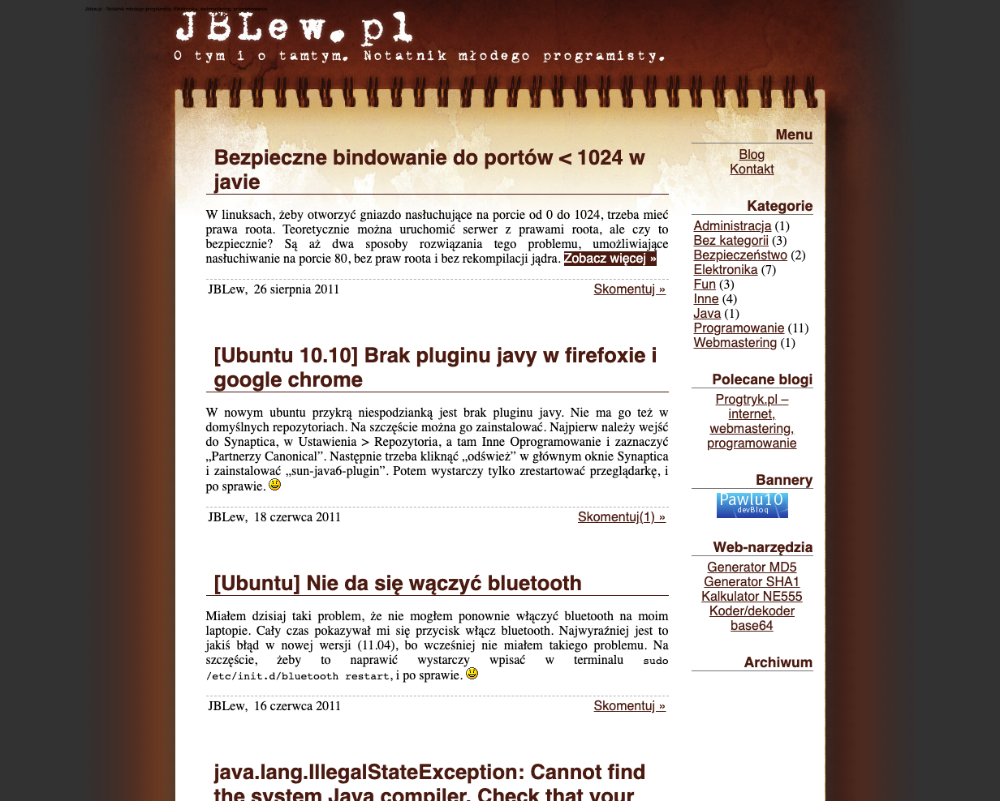

Czyli o tym kiedy zacząłem programować i jak wyglądał mój "blog o programowaniu" w gimnazjum

<!--more-->

Styczność z komputerem miałem odkąd pamiętam. Jako jedni z niewielu mieliśmy komputer w domu już od 1993 roku, czyli przed moim urodzeniem. Mam jeszcze w pamięci Windows 95 i 98, zabawy z paintem a nawet proste trójwymiarowe gry, oraz sławny przycisk "turbo na komputerze". 

Poważniejsze podejście do komputera to rok 2003, komputer z kartą graficzną i Windowsem XP. Żywo interesowałem się grafiką trójwymiarową i programem 3DStudio, chociaż język angielski był dla mnie wtedy dużym wyzwaniem.

Przełomem był rok 2004, kiedy mój Ojciec zaczął mnie uczyć programowania w Javie i podstaw HTMLa. W 2005 roku z pomocą Taty, 3 iframeów, mnóstwa tabel stworzyłem pierwszą stronę internetową dla szkoły. Ponieważ internet dopiero się upowszechniał, fakt posiadania strony przez szkołę był powodem do dumy, strona była bardzo aktywnie prowadzona, wstawialiśmy zdjęcia z każdej wycieczki czy meczu. Bardzo żałuję, że nie mam żadnych screenshotów z tamtego okresu.

### "Jblew.pl — notatki młodego programisty"

W 2009 roku zacząłem prowadzić swojego własnego bloga! W międzyczasie w dalszym ciągu rozwijałem się jako programista.

Niektóre z projektów z tamtego okresu to:

**2009 — system mailingu dla pobliskiego szpitala** Z racji zapotrzebowania w 2009 roku zbudowałem system mailingowy dla lokalnego szpitala, który organizował dużą konferencję i potrzebował wysłać bardzo dużą ilość zaproszeń. Wtedy wysyłanie maili nie było jeszcze tak skomplikowane jak dzisiaj i prawie wszystkie wiadomości dotarły do adresatów. Ten projekt nauczył mnie przede wszystkim współpracy ze szpitalnymi informatykami i prowadzenia szkolenia dla użytkowników: Do dzisiaj jestem pod ogromnym wrażeniem Pań z działu Promocji szpitala, które poradziły sobie z obsługą programu przez wiersz poleceń!

**2009 - 2010 — proste sieci neuronowe i symulatory genetyczne.** Można powiedzieć, że sieciami neuronowymi zainteresowałem się wtedy, kiedy jeszcze nie było to tak modne (był to okres drugiej zimy AI). Przeprowadzałem wtedy sporo eksperymentów używając książek z lat 80 i 90 znalezionych w bibliotece.

**2008 - 2012 — piszemy MUDa.** To zdecydowanie największy niekomercyjny projekt w moim życiu. Przez 4 lata wraz z kolegą pisaliśmy grę tekstową typu MUD. Jak wszystkie MUDy, gra była wieloosobowa, czasu rzeczywistego i grało się w nią poprzez wydawanie komend tekstowych przez terminal i telnet. Przez te 4 lata napisaliśmy sześć wersji gry tworząc w sumie ponad 60 tysięcy SLOC. Pisaliśmy najpierw w PHP a potem przenieśliśmy się do Javy aby móc używać wielowątkowości bez konieczności korzystania z semaforów ;) (wtedy PHP nie pozwalało na współdzielenie zmiennych między wątkami). Przekroczyliśmy kilka kroków milowych informatyki rozpoczynając tworzenie projektu w SVN, poprzez Mercurial a kończąc na GIT-cie. 

### Medycyna

Do dzisiaj zastanawiam się co skłoniło mnie do porzucienia ścieżki IT. Nie jest to jasne. Pamiętam tylko, że latem 2012 roku w ramach dni otwartych UWM odwiedziłem laboratorium weterynaryjnego in vitro w Olsztynie. Wtedy w mojej głowie wykiełkowała myśl, że przecież są inne ścieżki kariery niż bycie programistą.

Zdaje się, że chyba po prostu byłem już znudzony programowaniem, a może coś mnie zniechęciło. W każdym razie postanowiłem zostać Bioinformatykiem i intensywnie zabrałem się do studiowania licealnych podręczników biologii.

Nauka była chyba zbyt intensywna, bo dosyć szybko zdałem sobie sprawę, że w zasadzie dokładając trochę więcej wysiłku mógłbym dostać się na medycynę. Wydawało mi się to wtedy tak dużym kamieniem milowym, zakazaną dziedziną, czymś magicznym, że nawet nie zadawałem sobie pytania, czy właściwie chcę pracować jako lekarz.

Po 1,5 roku intensywnej nauki biologii i chemii rzeczywiście dostałem się na kierunek lekartski na drugim wydziale lekarskim w Warszawie. We wrześniu 2014 roku przed samym rozpoczęciem studiów ostatecznie ZERWAŁEM Z PROGRAMOWANIEM. Wszystkie repozytoria, które miałem na komputerze zacommitowałem, opisałem je i spushowalem na AmazonS3. To miał być koniec Jędrzeja w IT.

Pierwszy rok był tak samo intensywny jak nauka do matury, więc w zasadzie nie miałem czasu na refleksję czy jest to właściwa ścieżka kariery. Dopiero na drugim roku zacząłem szukać i się zastanawiać. Zacząłem eksperymentować z dyżurami chirurgicznymi i kołami naukowymi. Przy okazji (głównie w celach towarzyskich) zapisałem się do Akademickiego Stowarzyszenia Katolickiego Soli Deo (ASK Soli Deo). Tam bardzo szybko okazało się, że moje umiejętności IT się przydają — zaangażowałem się w informatyzację stowarzyszenia, w stronę internetową — a przede wszystkim w tworzenie automatycznych systemów oświetleniowych na imprezy. W tamtym okresie stowarzyszenie robiło bardzo duże bezalkoholowe dyskoteki na 100-200 osób, tańczyliśmy na dużych parkietach jak np. podziemia pod katedrą Warszawsko-Praską św. Floriana, Aula Wydziału Fizyki PW czy nawet sama sala bankietowa Gmachu Głównego PW. Problemem był brak środków na zakup sprzętu oświetleniowego na tak ogromne parkiety. Tutaj bardzo przydały się moje umiejętności i stworzylem kilka sterowanych dźwiękiem systemów oświetleniowych z dużych ilości taśmy LED oraz setek metrów kabla telefonicznego 4-żyłowego do komunikacji. W taki sposób powróciłem na łono IT. Wywołało to też u mnie kryzys powołaniowy i zacząłem zastanawiać się nad porzuceniem studiów.

Na 4 roku pojawiła się okazja — poznałem Krzysztofa Szumnego, który właśnie zakładał wtedy startup blockchainowy WISE. Krzysiek zaufał mi i pozwolił stworzyć cały ten system pracując na 1/2 etatu oraz weekendy. To on uczynił mnie Architektem i dał mi niebywałą możliwość przećwiczenia umiejętności. Ze względu na naturę rynku kryptowalutowego ta działalność przestała się w pewnym momencie opłacać i musieliśmy po 2 latach wyłączyć nasz system.

Mając w dalszym ciągu wątpliwości natury powołaniowej w 2019 roku postanowiłem przetestować się w IT na pełen etat. Wziąłem Urlop Dziekański i zatrudniłem się na 14 miesięcy w brytyjskiej firmie Pitchup. 

Teraz (jesień 2020) urlop zakończył się i wróciłem na studia zdeterminowany, aby zakończyć je oraz dobrze zdać Lekarski Egzamin Końcowy. Tu jestem w tym momencie życia.

Co będzie dalej? Nie wiem, ale na pewno będzie ciekawie!